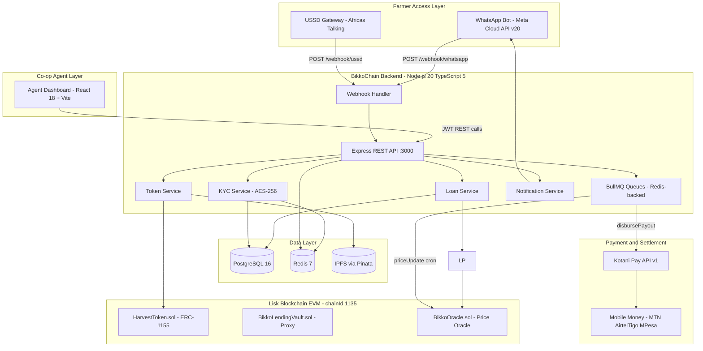

# Architecture Overview: BikkoChain

Complete technical architecture, integration endpoints, data flows, and engineering stack for BikkoChain. Sourced from CTO Technical Architecture Brief (doc.md, v1.0, June 2026).

---

## 🛠️ High-Level System Architecture



---

## 🧱 Technology Stack

### Backend Services

| Package | Version | Purpose |
|---|---|---|
| Node.js | 20 LTS | Backend runtime |
| TypeScript | 5.x | Type safety |
| Express | 4.x | HTTP server |
| Prisma | 5.x | PostgreSQL ORM |
| ioredis | latest | Redis client (sessions, USSD cache) |
| BullMQ | latest | Redis-backed job queues (NOT `bull` v3/v4) |
| ethers | 6.x | Lisk smart contract interaction |
| jsonwebtoken | latest | Agent/admin JWT auth (HS256, 8h expiry) |
| axios | latest | Kotani Pay & Meta API calls |
| zod | latest | Request validation |
| winston | latest | Structured logging |
| express-rate-limit | latest | API rate limiting (100 req/15min) |
| helmet | latest | HTTP security headers |

### Smart Contracts

| Tool | Version | Purpose |
|---|---|---|
| Solidity | ^0.8.20 | Smart contracts |
| Foundry | latest | Development toolchain (forge) |
| OpenZeppelin | 5.x | Contract base libraries |
| Slither | latest | Static analysis (CI gate) |
| Mythril | latest | Security analysis |

### Agent Dashboard

| Package | Version | Purpose |
|---|---|---|
| React | 18 | UI framework |
| Vite | 5 | Build tool |
| TypeScript | 5.x | Type safety |
| TanStack Query | 5 | Server state management |
| Tailwind CSS | 3 | Styling |
| shadcn/ui | latest | Component library |

### Public Website (bikkofarms-platform)

| Package | Version | Purpose |
|---|---|---|
| Next.js | App Router | Public site & SEO |
| TypeScript | 5.x | Type safety |
| Tailwind CSS | 4 | Styling |
| shadcn/ui | latest | Components |

---

## 🔗 Network Configuration

### Lisk Blockchain

```typescript
// foundry.toml
[profile.default]
src = "src"
out = "out"
libs = ["lib"]

[rpc_endpoints]
liskSepolia = "https://rpc.sepolia-api.lisk.com"
liskMainnet = "https://rpc.api.lisk.com"
```

- **Testnet Faucet:** https://sepolia-faucet.lisk.com
- **USDC on Lisk Mainnet:** `0x18eb25a15ec48db3c42a0f41ec0a716ba6b54514`

---

## 🧱 Core Architectural Layers

### 1. Farmer Interface Layer

**WhatsApp Bot (Meta Cloud API v20.0):**
- Incoming messages: HTTP POST webhook at `/webhook/whatsapp`
- Outgoing messages: `POST https://graph.facebook.com/v20.0/{PHONE_NUMBER_ID}/messages`
- Webhook verification: GET challenge/response with `WA_VERIFY_TOKEN`
- Payload signature: `X-Hub-Signature-256` verified with `WA_APP_SECRET`
- **Session state in Redis:** Key: `whatsapp:session:{phoneNumber}`, TTL: 24h
- 24-hour conversation window rule: use pre-approved templates for outbound notifications
- Pre-approved templates required: `loan_approved`, `repayment_reminder`, `loan_disbursed`

**USSD Gateway (Africa's Talking):**
- AT sends POST to `/webhook/ussd` on every user input
- Payload: `application/x-www-form-urlencoded` with `sessionId`, `serviceCode`, `phoneNumber`, `text`
- Response: must start with `CON ` (continue) or `END ` (terminate)
- Response must arrive in **under 3 seconds** or session times out
- State keyed by `sessionId` in Redis, TTL: 3 minutes
- `text` field is cumulative, asterisk-separated: `text="2*100*400"` = [menu: 2, amount: 100, harvest: 400]
- Supported carriers in Ghana: MTN, AirtelTigo, Telecel (all via AT)

### 2. The RWA Tokenization Layer

Every harvest tokenization cycle:
1. Backend calls `BikkoOracle.getCocoaPrice()` for current USD/kg price
2. Backend uploads metadata JSON (GPS, kg, EPCIS events, EUDR GPS point) to IPFS via Pinata
3. Backend calls `HarvestToken.mint(farmerWallet, amount, ipfsUri)` — ERC-1155
4. Token ID and IPFS CID stored in `HARVEST_TOKENS` table

EPCIS metadata stored on IPFS includes: `farmerId`, `gpsCoordinates`, `cropType`, `estimatedKg`, `harvestSeason`, `organicCertified`, `deforestationFreeProof`, and EPCIS event chain.

### 3. The Lending & Escrow Engine

**Smart Contracts:**
- `HarvestToken.sol` — ERC-1155 with `MINTER_ROLE` (backend relayer wallet)
- `BikkoLendingVault.sol` — manages private lending vault: `registerFarmer()`, `lockCollateral()`, `repayLoan()`, `liquidate()`
- `BikkoOracle.sol` — MVP admin-controlled price oracle with `updatePrice(uint256 cocoaUsdPerKg)` and `updateCoffeePrice(uint256 coffeeUsdPerKg)`
- `TransparentUpgradeableProxy` — wraps `BikkoLendingVault.sol` with 7-day timelock admin

**LTV Calculation:** `harvestKg × pricePerKg × 0.70 = maxLoan`. E.g. 500kg × $3.20 × 70% = $1,120 max.

**Contract Events (indexed to PostgreSQL by event listener process):**
- `FarmerRegistered(farmer, village)`
- `CollateralLocked(loanId, agent)`
- `LoanRepaid(loanId, amount)`
- `CollateralLiquidated(loanId, tokenId)`
- `HarvestTokenized(tokenId, farmer, amount, epcisUri)`

### 4. The Middleware Layer

The Express backend is a stateful service handling:
- USSD state machines (Redis-backed)
- WhatsApp conversation sessions (Redis-backed)
- JWT authentication for agent/admin (HS256, 8h expiry)
- Webhook signature verification (WhatsApp + Kotani Pay)
- Idempotency enforcement (WEBHOOK_EVENTS table)
- BullMQ queue producers

### 5. Payment Settlement Layer

Kotani Pay flow:
1. Backend transfers USDC to Kotani Pay deposit address (ethers.js v6)
2. `POST /v1/quotes` → get exchange rate + quoteId
3. `POST /v1/payouts` → send {quoteId, recipient: {type: mobile_money, phone, provider}}
4. Kotani Pay webhook `payout.completed` → update loan status to DISBURSED
5. Backend sends WhatsApp confirmation to farmer

### 6. Job Queue Architecture (BullMQ + Redis)

| Queue | Priority | Logic |
|---|---|---|
| `disbursement-queue` | HIGH | Kotani Pay payout. 5 attempts, exponential backoff (1m→5m→15m→1h→4h). Dead-letter on 5th failure |
| `reminder-queue` | LOW | Repayment reminders via WhatsApp. Cron: daily 8am Ghana time (UTC+0) |
| `sync-queue` | MEDIUM | Lisk event indexer — polls every 30s, syncs to PostgreSQL |
| `price-update-queue` | LOW | Admin oracle price update — cron: daily. Calls `BikkoOracle.updatePrice()` |

Dead-letter queue alerts admin via Slack webhook or email.

---

## 🚀 Infrastructure & Environments

### Development (Weeks 1-8)
- **Local:** Docker Compose (PostgreSQL 16 + Redis 7 + Node.js backend)
- **Blockchain:** Lisk Sepolia testnet (chainId: 4242)
- **Webhooks:** ngrok to expose localhost to AT and Meta webhooks
- **Hosting:** Railway.app or Render.com ($20-50/month)

### Production (Render)
- **Render Web Service** — Node.js backend + BullMQ workers (Standard plan, autoscale on)
- **Render PostgreSQL** — Managed PostgreSQL 16 (Standard plan, daily backups)
- **Render Redis** — Managed Redis 7 (Standard plan)
- **Render Static Site** — Agent Dashboard (built from `bikkofarms-dashboard/dist/`)
- **Render Cron Jobs** — Price update cron (alternative to BullMQ cron if desired)
- **Render Logs** — Built-in log streaming per service
- **Render Secret Files / Env Groups** — All environment variables set in Render dashboard, never in committed files
- **Private key (relayer wallet):** Store in Render environment variables (encrypted at rest) + use Doppler for secret rotation in Phase 2

### CI/CD
- GitHub Actions (`.github/workflows/`)
- Frontend merges to `main` → auto-deploy to Vercel
- Backend merges to `main` → Docker build → Render/EC2
- Contracts: Foundry deploy script → Lisk Sepolia (then mainnet on explicit trigger)

---

## 📁 Monorepo Structure

```
bikkofarms-platform/
├── bikkofarms-backend/      # Node.js / Express / Prisma / BullMQ
│   ├── src/
│   │   ├── config/          # env, db, redis, blockchain clients
│   │   ├── routes/          # webhook.ts, loans.ts, farmers.ts, admin.ts
│   │   ├── services/        # WhatsAppService, UssdService, LoanService,
│   │   │                    #   TokenService, KotaniService, NotificationService,
│   │   │                    #   BlockchainService
│   │   ├── queues/          # disbursementQueue.ts, reminderQueue.ts,
│   │   │                    #   syncQueue.ts, priceUpdateQueue.ts
│   │   ├── middleware/      # auth.ts, idempotency.ts, rateLimiter.ts
│   │   ├── prisma/          # schema.prisma
│   │   └── jobs/            # disbursePayout.ts, sendReminder.ts, syncEvents.ts
│   ├── docker-compose.yml
│   └── package.json
│
├── bikkofarms-contracts/    # Foundry / Solidity / OpenZeppelin
│   ├── src/
│   │   ├── HarvestToken.sol       # ERC-1155
│   │   ├── BikkoLendingVault.sol  # Private vault logic
│   │   └── BikkoOracle.sol        # Admin price oracle (MVP)
│   ├── test/                # *.t.sol tests in Solidity
│   ├── script/              # Deploy.s.sol deployment script
│   └── foundry.toml
│
├── bikkofarms-dashboard/    # React 18 + Vite + TanStack Query
│   ├── src/
│   │   ├── pages/           # login, dashboard, farmers, loans, payouts, analytics
│   │   ├── components/
│   │   └── lib/             # api client, query hooks
│   └── package.json
│
├── bikkofarms-ussd/         # Stateless USSD client gateway
│   ├── src/                 # AT integration and Redis state machine
│   └── package.json
│
├── bikkofarms-whatsappbot/  # WhatsApp Bot client gateway
│   ├── src/                 # Meta Cloud API integration and Redis dialog trees
│   └── package.json

bikkofarms-platform/          # Next.js public site
├── src/app/                 # App Router pages
├── .ai/                     # AI engineering OS (this directory)
└── .github/                 # CI/CD workflows, PR template, issue templates
```
