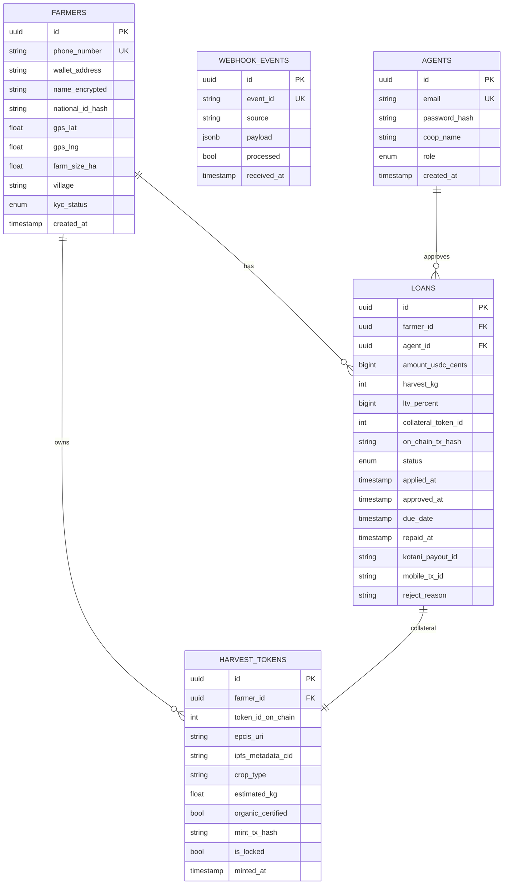

# Context: Database Schema

Full PostgreSQL database schema for BikkoChain. Use this as the authoritative reference for Prisma schema definitions.

---

## 📐 Entity Relationship Diagram



---

## 📋 Enum Values

### `farmers.kyc_status`
- `UNVERIFIED` — Just registered, KYC not yet done
- `PENDING` — KYC submitted, under agent review
- `VERIFIED` — KYC passed, eligible for loans
- `REJECTED` — KYC failed

### `loans.status`
- `PENDING` — Applied, awaiting agent approval
- `APPROVED` — Agent approved, collateral locked on chain
- `DISBURSING` — USDC transferred to Kotani Pay, payout pending
- `DISBURSED` — Mobile money sent to farmer
- `REPAID` — Farmer repaid, harvest token released
- `DEFAULTED` — Due date passed, no repayment
- `LIQUIDATED` — Collateral liquidated by agent/admin
- `REJECTED` — Agent rejected loan application

### `agents.role`
- `AGENT` — Co-op agent: can approve/reject loans, view farmers
- `ADMIN` — Full access: analytics, system config, agent management

---

## 🔑 Critical Index Constraints

```sql
-- Farmers
CREATE UNIQUE INDEX idx_farmers_phone ON farmers(phone_number);
CREATE INDEX idx_farmers_kyc_status ON farmers(kyc_status);
CREATE INDEX idx_farmers_wallet ON farmers(wallet_address);

-- Loans
CREATE INDEX idx_loans_farmer_id ON loans(farmer_id);
CREATE INDEX idx_loans_agent_id ON loans(agent_id);
CREATE INDEX idx_loans_status ON loans(status);
CREATE INDEX idx_loans_applied_at ON loans(applied_at);
CREATE INDEX idx_loans_collateral_token_id ON loans(collateral_token_id);

-- Harvest Tokens
CREATE INDEX idx_harvest_tokens_farmer_id ON harvest_tokens(farmer_id);
CREATE INDEX idx_harvest_tokens_token_id ON harvest_tokens(token_id_on_chain);
CREATE UNIQUE INDEX idx_harvest_tokens_ipfs_cid ON harvest_tokens(ipfs_metadata_cid);

-- Webhook Events
CREATE UNIQUE INDEX idx_webhook_events_event_id ON webhook_events(event_id);
CREATE INDEX idx_webhook_events_processed ON webhook_events(processed);
```

---

## 🔒 Security Notes

- `name_encrypted` — stored with AES-256 via PostgreSQL `pgcrypto` extension
- `national_id_hash` — SHA-256 hash stored on-chain and in DB, never plaintext
- `password_hash` — bcrypt with minimum 12 rounds
- All UUIDs are v4 (random) to prevent enumeration attacks

---

## 🔄 Idempotency Pattern (WEBHOOK_EVENTS)

All webhook handlers MUST implement this pattern:

```typescript
// middleware/idempotency.ts
async function handleWebhook(eventId: string, source: string, payload: unknown, processor: () => Promise<void>) {
  // Check if already processed
  const existing = await db.webhookEvent.findUnique({ where: { eventId } });
  if (existing?.processed) {
    return { status: 'already_processed' };
  }

  // Upsert event immediately (prevents race conditions)
  await db.webhookEvent.upsert({
    where: { eventId },
    create: { eventId, source, payload: payload as Prisma.JsonObject, processed: false },
    update: {}
  });

  // Process
  await processor();

  // Mark processed
  await db.webhookEvent.update({ where: { eventId }, data: { processed: true } });
}
```

Sources for `event_id`:
- WhatsApp: `req.body.entry[0].changes[0].value.messages[0].id`
- Kotani Pay: `req.headers['x-kotani-event-id']`
- Africa's Talking: `req.body.sessionId` (for terminal events only)

---

## 📊 Prisma Schema (Reference)

See `bikkofarms-backend/src/prisma/schema.prisma` for the full Prisma schema. Key models:

```prisma
model Farmer {
  id              String    @id @default(uuid())
  phoneNumber     String    @unique @map("phone_number")
  walletAddress   String?   @map("wallet_address")
  nameEncrypted   String    @map("name_encrypted")
  nationalIdHash  String    @map("national_id_hash")
  gpsLat          Float?    @map("gps_lat")
  gpsLng          Float?    @map("gps_lng")
  farmSizeHa      Float?    @map("farm_size_ha")
  village         String?
  kycStatus       KycStatus @default(UNVERIFIED) @map("kyc_status")
  createdAt       DateTime  @default(now()) @map("created_at")
  loans           Loan[]
  harvestTokens   HarvestToken[]
  @@map("farmers")
}

model Loan {
  id                 String    @id @default(uuid())
  farmerId           String    @map("farmer_id")
  agentId            String?   @map("agent_id")
  amountUsdcCents    BigInt    @map("amount_usdc_cents")
  harvestKg          Int       @map("harvest_kg")
  ltvPercent         BigInt    @map("ltv_percent")
  collateralTokenId  Int?      @map("collateral_token_id")
  onChainTxHash      String?   @map("on_chain_tx_hash")
  status             LoanStatus @default(PENDING)
  appliedAt          DateTime  @default(now()) @map("applied_at")
  approvedAt         DateTime? @map("approved_at")
  dueDate            DateTime? @map("due_date")
  repaidAt           DateTime? @map("repaid_at")
  kotaniPayoutId     String?   @map("kotani_payout_id")
  mobileTxId         String?   @map("mobile_tx_id")
  rejectReason       String?   @map("reject_reason")
  farmer             Farmer    @relation(fields: [farmerId], references: [id])
  agent              Agent?    @relation(fields: [agentId], references: [id])
  @@map("loans")
}
```
