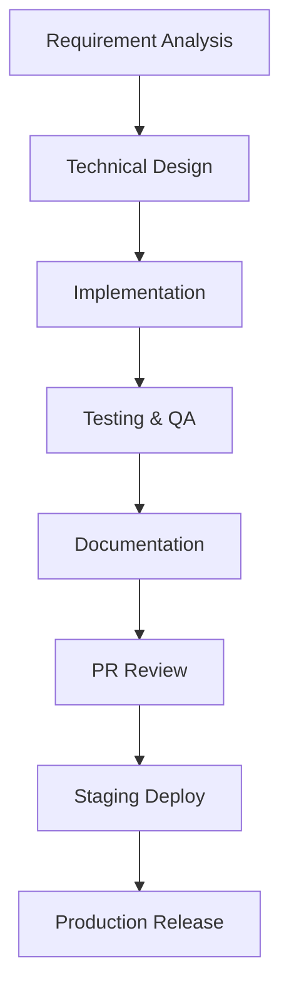

# Workflow: Feature Development

Standard operating procedure for creating new features and system components.

---

## 🧭 Flow Map

---

## 🛠️ Step-by-Step Procedure

### Step 1: Requirement Analysis
* **Roles:** Product Manager, Lead Engineers.
* **Goal:** Understand user needs and MVP boundaries. Write user stories and define acceptance criteria.
* **Output:** User story ticket or feature spec description.

### Step 2: Technical Design
* **Roles:** Implementation Lead, specialized AI Agent.
* **Goal:** Choose the tech stack adjustments, model databases, design contract interfaces, and write an Implementation Plan.
* **Output:** `implementation_plan.md` (and a new ADR if introducing architectural changes).

### Step 3: Implementation
* **Roles:** Frontend / Backend / Blockchain Agents.
* **Goal:** Write clean, typed, and structured code that satisfies global agent rules and skill guidelines.
* **Output:** Feature code commits on branch `feature/[feature-name]`.

### Step 4: Testing & QA
* **Roles:** QA Agent.
* **Goal:** Write unit and integration test scripts covering critical paths. Run tests locally and assert coverage targets.
* **Output:** Test reports showing all green pass validations.

### Step 5: Documentation
* **Roles:** Implementation Lead.
* **Goal:** Add inline JSDoc comments, update `/docs/` paths, update `.ai/` files if design patterns evolved.
* **Output:** Updated markdown guides.

### Step 6: PR Review
* **Roles:** Senior Engineers.
* **Goal:** Check branch commits against PR template checklists. Review code, security constraints, and verify tests.
* **Output:** Approved pull request.

### Step 7: Staging Deployment
* **Roles:** DevOps Agent.
* **Goal:** Merge branch into `dev`. Auto-build to staging environments (Vercel staging, Render staging, Lisk Sepolia testnet). Run manual integration checks.
* **Output:** Verifiable staging deployment.

### Step 8: Production Release
* **Roles:** Senior Engineer, DevOps Agent.
* **Goal:** Merge `dev` into `main`. Deploy backend APIs, deploy Next.js site to production, deploy contracts to Lisk Mainnet, notify teams.
* **Output:** Active production feature release.
