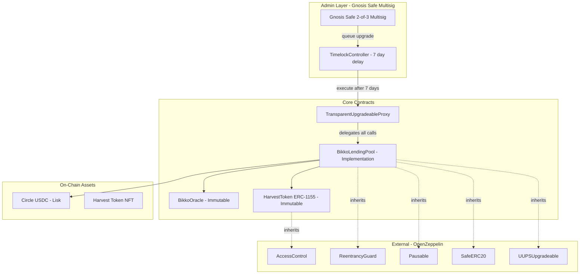
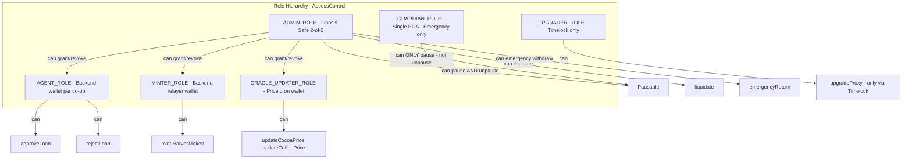
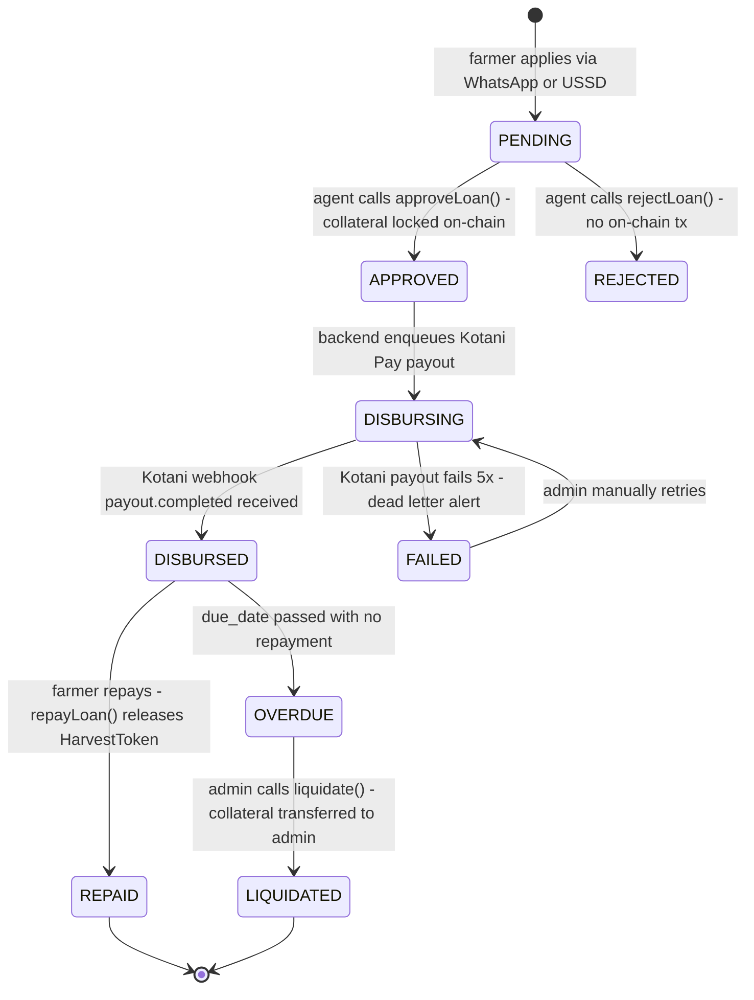
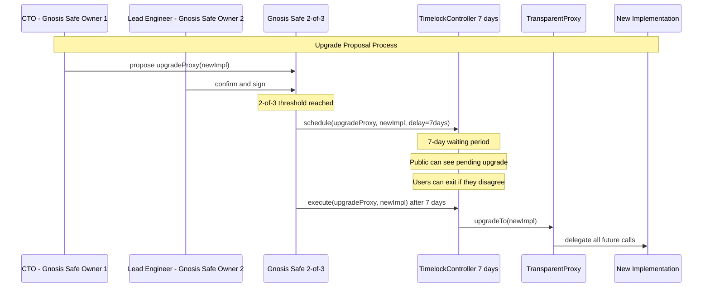
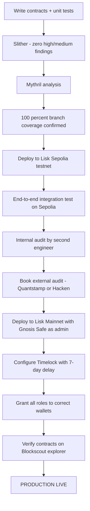

# BikkoChain Smart Contract Architecture

**Engineering Standard:** Ethereum Foundation / OpenZeppelin / Trail of Bits quality.
**Security Posture:** Defence-in-depth. Assume the attacker has read every line of this code.
**Design Philosophy:** Immutable where possible. Upgradeable only where unavoidable. Multi-sig admin. User funds always recoverable.

---

## 1. Contract Map & Relationships



---

## 2. Access Control Hierarchy

> Designed so that **no single key** can drain funds, upgrade contracts, or manipulate prices simultaneously.



### Role Definitions

| Role | Holder | Can Do | Cannot Do |
|---|---|---|---|
| `ADMIN_ROLE` | Gnosis Safe 2-of-3 | Pause/unpause, liquidate, emergency return, grant roles | Upgrade proxy directly (must go via Timelock) |
| `GUARDIAN_ROLE` | Single EOA (on-call engineer) | Pause lending in emergency | Unpause, upgrade, mint, move funds |
| `AGENT_ROLE` | Backend wallet per co-op | Approve / reject loans | Mint tokens, change prices, upgrade |
| `MINTER_ROLE` | Backend relayer wallet | Mint HarvestToken NFTs | Approve loans, change prices, upgrade |
| `ORACLE_UPDATER_ROLE` | Backend price cron wallet | Update cocoa/coffee prices | Mint, approve loans, upgrade |
| `UPGRADER_ROLE` | TimelockController only | Execute proxy upgrades | Nothing else (contract-only role) |

**Why separate wallets per role?** — A compromised price cron key cannot mint NFTs. A compromised relayer cannot approve loans. Blast radius of any single key compromise is bounded.

---

## 3. Contract Security Layers

```mermaid
graph LR
    subgraph L1["Layer 1 - Access Control"]
        AC1[onlyRole modifiers]
        AC2[msg.sender checks]
        AC3[Gnosis Safe multisig]
    end

    subgraph L2["Layer 2 - Execution Safety"]
        EX1[ReentrancyGuard - nonReentrant]
        EX2[Checks Effects Interactions]
        EX3[Pausable - emergency stop]
    end

    subgraph L3["Layer 3 - Asset Safety"]
        AS1[SafeERC20 - safeTransfer only]
        AS2[Pull pattern - farmers claim]
        AS3[emergencyReturn - admin can return collateral]
    end

    subgraph L4["Layer 4 - Oracle Safety"]
        OR1[48h staleness guard]
        OR2[Price bounds check - max 10x change per update]
        OR3[Dual price confirmation]
    end

    subgraph L5["Layer 5 - Upgrade Safety"]
        UP1[7-day TimelockController]
        UP2[TransparentUpgradeableProxy]
        UP3[Slither + Mythril in CI]
    end

    L1 --> L2 --> L3 --> L4 --> L5
```



---

## 4. Loan Lifecycle State Machine



**On-chain state transitions (BikkoLendingPool.sol):**

| Transition | Who | On-Chain Action |
|---|---|---|
| `PENDING → APPROVED` | `AGENT_ROLE` wallet | `HarvestToken.safeTransferFrom(farmer → pool)` + emit `LoanApproved` |
| `APPROVED → DISBURSED` | Backend (off-chain Kotani webhook) | DB-only update; USDC already moved by backend before Kotani call |
| `DISBURSED → REPAID` | Backend after Kotani on-ramp + farmer repay | `repayLoan(id)` → `HarvestToken.safeTransferFrom(pool → farmer)` |
| `OVERDUE → LIQUIDATED` | `ADMIN_ROLE` Gnosis Safe | `liquidate(id)` → `HarvestToken.safeTransferFrom(pool → adminSafe)` |

---

## 5. Complete Contract Interface

### 5.1 HarvestToken.sol (IMMUTABLE — no proxy)

**Why immutable?** Farmers and lenders must trust that token mechanics never change. Immutability = maximum trust.

```solidity
// SPDX-License-Identifier: MIT
pragma solidity ^0.8.20;

import "@openzeppelin/contracts/token/ERC1155/ERC1155.sol";
import "@openzeppelin/contracts/access/AccessControl.sol";
import "@openzeppelin/contracts/utils/Pausable.sol";

contract HarvestToken is ERC1155, AccessControl, Pausable {

    bytes32 public constant MINTER_ROLE   = keccak256("MINTER_ROLE");
    bytes32 public constant GUARDIAN_ROLE = keccak256("GUARDIAN_ROLE");

    // tokenId => metadata URI (ipfs://CID)
    mapping(uint256 => string) private _tokenURIs;
    // tokenId => whether locked as collateral
    mapping(uint256 => bool) public isLockedAsCollateral;

    uint256 private _nextTokenId = 1;

    event HarvestTokenized(
        uint256 indexed tokenId,
        address indexed farmer,
        uint256 amountKg,
        string  ipfsUri
    );
    event CollateralLocked(uint256 indexed tokenId, address indexed lendingPool);
    event CollateralReleased(uint256 indexed tokenId, address indexed farmer);

    constructor(address adminSafe) ERC1155("") {
        _grantRole(DEFAULT_ADMIN_ROLE, adminSafe); // Gnosis Safe only
        _grantRole(GUARDIAN_ROLE, adminSafe);
    }

    /// @notice Mint a harvest token NFT representing a future crop batch.
    /// @dev Only callable by MINTER_ROLE (backend relayer wallet).
    function mint(
        address farmer,
        uint256 amountKg,
        string calldata ipfsUri
    ) external onlyRole(MINTER_ROLE) whenNotPaused returns (uint256 tokenId) {
        tokenId = _nextTokenId++;
        _tokenURIs[tokenId] = ipfsUri;
        _mint(farmer, tokenId, 1, "");
        emit HarvestTokenized(tokenId, farmer, amountKg, ipfsUri);
    }

    /// @dev Override uri() to return per-token URI.
    function uri(uint256 tokenId) public view override returns (string memory) {
        return _tokenURIs[tokenId];
    }

    /// @notice Mark token as locked — prevents secondary transfer while in escrow.
    function markLocked(uint256 tokenId) external onlyRole(DEFAULT_ADMIN_ROLE) {
        isLockedAsCollateral[tokenId] = true;
        emit CollateralLocked(tokenId, msg.sender);
    }

    function markReleased(uint256 tokenId) external onlyRole(DEFAULT_ADMIN_ROLE) {
        isLockedAsCollateral[tokenId] = false;
        emit CollateralReleased(tokenId, msg.sender);
    }

    /// @dev Block transfers of locked collateral tokens.
    function _beforeTokenTransfer(
        address, address, address, uint256[] memory ids, uint256[] memory, bytes memory
    ) internal view {
        for (uint256 i = 0; i < ids.length; i++) {
            require(!isLockedAsCollateral[ids[i]], "HarvestToken: token is locked as collateral");
        }
    }

    /// @notice Guardian can pause minting/transfers in emergency.
    function pause()   external onlyRole(GUARDIAN_ROLE) { _pause(); }
    function unpause() external onlyRole(DEFAULT_ADMIN_ROLE) { _unpause(); }

    function supportsInterface(bytes4 interfaceId)
        public view override(ERC1155, AccessControl) returns (bool) {
        return super.supportsInterface(interfaceId);
    }
}
```

### 5.2 BikkoOracle.sol (IMMUTABLE — admin-controlled for MVP)

**Why immutable?** Oracle feeds a critical security boundary (LTV calculation). Upgradeability here would be a vector for price manipulation.

```solidity
// SPDX-License-Identifier: MIT
pragma solidity ^0.8.20;

import "@openzeppelin/contracts/access/AccessControl.sol";

contract BikkoOracle is AccessControl {

    bytes32 public constant ORACLE_UPDATER_ROLE = keccak256("ORACLE_UPDATER_ROLE");

    // Prices stored in USD cents per kg to avoid floating point.
    // e.g. cocoaUsdCentsPerKg = 320 means $3.20/kg
    uint256 public cocoaUsdCentsPerKg;
    uint256 public coffeeUsdCentsPerKg;
    uint256 public lastUpdated;

    // Safety: price cannot change by more than 50% in a single update.
    // Prevents a compromised oracle key from crashing the system.
    uint256 public constant MAX_PRICE_CHANGE_BPS = 5000; // 50%

    event CocoaPriceUpdated(uint256 oldPrice, uint256 newPrice, uint256 timestamp);
    event CoffeePriceUpdated(uint256 oldPrice, uint256 newPrice, uint256 timestamp);

    constructor(
        address adminSafe,
        address oracleUpdaterWallet,
        uint256 initialCocoaPrice,
        uint256 initialCoffeePrice
    ) {
        _grantRole(DEFAULT_ADMIN_ROLE, adminSafe);
        _grantRole(ORACLE_UPDATER_ROLE, oracleUpdaterWallet);
        cocoaUsdCentsPerKg  = initialCocoaPrice;
        coffeeUsdCentsPerKg = initialCoffeePrice;
        lastUpdated = block.timestamp;
    }

    function updateCocoaPrice(uint256 newPrice) external onlyRole(ORACLE_UPDATER_ROLE) {
        require(newPrice > 0, "Oracle: price cannot be zero");
        _assertPriceChangeSafe(cocoaUsdCentsPerKg, newPrice);
        uint256 old = cocoaUsdCentsPerKg;
        cocoaUsdCentsPerKg = newPrice;
        lastUpdated = block.timestamp;
        emit CocoaPriceUpdated(old, newPrice, block.timestamp);
    }

    function updateCoffeePrice(uint256 newPrice) external onlyRole(ORACLE_UPDATER_ROLE) {
        require(newPrice > 0, "Oracle: price cannot be zero");
        _assertPriceChangeSafe(coffeeUsdCentsPerKg, newPrice);
        uint256 old = coffeeUsdCentsPerKg;
        coffeeUsdCentsPerKg = newPrice;
        lastUpdated = block.timestamp;
        emit CoffeePriceUpdated(old, newPrice, block.timestamp);
    }

    function getCocoaPrice() external view returns (uint256) {
        return cocoaUsdCentsPerKg;
    }

    function getCoffeePrice() external view returns (uint256) {
        return coffeeUsdCentsPerKg;
    }

    function isStale() external view returns (bool) {
        return block.timestamp > lastUpdated + 48 hours;
    }

    /// @dev Reverts if new price deviates > 50% from current price.
    function _assertPriceChangeSafe(uint256 current, uint256 next) private pure {
        if (current == 0) return; // first update always allowed
        uint256 diff = next > current ? next - current : current - next;
        uint256 changeBps = (diff * 10_000) / current;
        require(changeBps <= MAX_PRICE_CHANGE_BPS, "Oracle: price change exceeds 50% limit");
    }
}
```

### 5.3 BikkoLendingPool.sol (UPGRADEABLE — TransparentProxy + Timelock)

**Why upgradeable?** Business rules (LTV ratio, interest rates, loan duration) will evolve. The 7-day timelock ensures users can exit if they disagree with an upgrade.

**Core security pattern — Checks-Effects-Interactions on every fund-moving function.**

```solidity
// SPDX-License-Identifier: MIT
pragma solidity ^0.8.20;

import "@openzeppelin/contracts-upgradeable/access/AccessControlUpgradeable.sol";
import "@openzeppelin/contracts-upgradeable/utils/ReentrancyGuardUpgradeable.sol";
import "@openzeppelin/contracts-upgradeable/utils/PausableUpgradeable.sol";
import "@openzeppelin/contracts-upgradeable/proxy/utils/UUPSUpgradeable.sol";
import "@openzeppelin/contracts-upgradeable/proxy/utils/Initializable.sol";
import "@openzeppelin/contracts/token/ERC20/utils/SafeERC20.sol";
import "@openzeppelin/contracts/token/ERC20/IERC20.sol";
import "./HarvestToken.sol";
import "./BikkoOracle.sol";

contract BikkoLendingPool is
    Initializable,
    AccessControlUpgradeable,
    ReentrancyGuardUpgradeable,
    PausableUpgradeable,
    UUPSUpgradeable
{
    using SafeERC20 for IERC20;

    // ─── Roles ──────────────────────────────────────────────────────────────
    bytes32 public constant AGENT_ROLE    = keccak256("AGENT_ROLE");
    bytes32 public constant GUARDIAN_ROLE = keccak256("GUARDIAN_ROLE");
    bytes32 public constant UPGRADER_ROLE = keccak256("UPGRADER_ROLE"); // Timelock only

    // ─── State ───────────────────────────────────────────────────────────────
    HarvestToken public harvestToken;
    BikkoOracle  public oracle;
    IERC20       public usdc;

    uint256 public ltvBps;         // Loan-to-value in basis points. Default: 7000 (70%)
    uint256 public maxLoanUsdc;    // Max single loan in USDC cents
    uint256 public loanDuration;   // Seconds until loan is overdue

    struct Loan {
        address farmer;
        uint256 amountUsdcCents;
        uint256 collateralTokenId;
        uint256 appliedAt;
        uint256 dueDate;
        LoanStatus status;
    }

    enum LoanStatus { PENDING, APPROVED, DISBURSED, REPAID, REJECTED, LIQUIDATED }

    mapping(bytes32 => Loan) public loans;      // loanId (bytes32) => Loan
    mapping(address => bool) public farmers;    // registered farmer addresses

    // ─── Events ──────────────────────────────────────────────────────────────
    event FarmerRegistered(address indexed farmer, string village);
    event LoanCreated(bytes32 indexed loanId, address indexed farmer, uint256 amountUsdcCents, uint256 tokenId);
    event LoanApproved(bytes32 indexed loanId, address indexed agent);
    event LoanRepaid(bytes32 indexed loanId, uint256 amountUsdcCents);
    event LoanRejected(bytes32 indexed loanId, string reason);
    event CollateralLiquidated(bytes32 indexed loanId, uint256 tokenId, address indexed to);
    event EmergencyReturn(bytes32 indexed loanId, address indexed farmer, uint256 tokenId);
    event LtvUpdated(uint256 oldBps, uint256 newBps);

    // ─── Initializer (replaces constructor for upgradeable) ─────────────────
    /// @custom:oz-upgrades-unsafe-allow constructor
    constructor() { _disableInitializers(); }

    function initialize(
        address adminSafe,
        address timelockAddress,
        address guardianEOA,
        address harvestTokenAddr,
        address oracleAddr,
        address usdcAddr,
        uint256 _ltvBps,
        uint256 _maxLoanUsdc,
        uint256 _loanDuration
    ) external initializer {
        __AccessControl_init();
        __ReentrancyGuard_init();
        __Pausable_init();
        __UUPSUpgradeable_init();

        _grantRole(DEFAULT_ADMIN_ROLE, adminSafe);      // Gnosis Safe
        _grantRole(GUARDIAN_ROLE, guardianEOA);          // On-call EOA - pause only
        _grantRole(UPGRADER_ROLE, timelockAddress);      // Timelock - upgrade only

        harvestToken = HarvestToken(harvestTokenAddr);
        oracle = BikkoOracle(oracleAddr);
        usdc   = IERC20(usdcAddr);

        ltvBps       = _ltvBps;       // 7000 = 70%
        maxLoanUsdc  = _maxLoanUsdc;  // e.g. 20000 = $200 USDC
        loanDuration = _loanDuration; // e.g. 90 days
    }

    // ─── Farmer Registration ─────────────────────────────────────────────────
    function registerFarmer(address farmer, string calldata village) external whenNotPaused {
        require(!farmers[farmer], "Pool: already registered");
        farmers[farmer] = true;
        emit FarmerRegistered(farmer, village);
    }

    // ─── Loan Application ────────────────────────────────────────────────────
    /// @notice Submit a loan application. Farmer must already hold the harvest token.
    function applyLoan(
        bytes32 loanId,
        address farmer,
        uint256 amountUsdcCents,
        uint256 collateralTokenId,
        uint256 harvestKg,
        string calldata cropType
    ) external whenNotPaused {
        // ── Checks ──
        require(farmers[farmer], "Pool: farmer not registered");
        require(loans[loanId].farmer == address(0), "Pool: loan ID already exists");
        require(amountUsdcCents > 0 && amountUsdcCents <= maxLoanUsdc, "Pool: amount out of bounds");
        require(!oracle.isStale(), "Pool: oracle price is stale");
        require(harvestToken.balanceOf(farmer, collateralTokenId) == 1, "Pool: farmer does not own token");

        // LTV check
        uint256 pricePerKg = keccak256(bytes(cropType)) == keccak256("cocoa")
            ? oracle.getCocoaPrice()
            : oracle.getCoffeePrice();
        uint256 maxLoan = (harvestKg * pricePerKg * ltvBps) / 10_000;
        require(amountUsdcCents <= maxLoan, "Pool: exceeds LTV limit");

        // ── Effects ──
        loans[loanId] = Loan({
            farmer: farmer,
            amountUsdcCents: amountUsdcCents,
            collateralTokenId: collateralTokenId,
            appliedAt: block.timestamp,
            dueDate: 0,
            status: LoanStatus.PENDING
        });

        emit LoanCreated(loanId, farmer, amountUsdcCents, collateralTokenId);
        // ── Interactions (none needed here) ──
    }

    // ─── Loan Approval ───────────────────────────────────────────────────────
    /// @notice Agent approves loan. Locks collateral in pool.
    /// @dev nonReentrant protects against reentrancy via ERC-1155 receiver hook.
    function approveLoan(bytes32 loanId) external onlyRole(AGENT_ROLE) whenNotPaused nonReentrant {
        // ── Checks ──
        Loan storage loan = loans[loanId];
        require(loan.farmer != address(0), "Pool: loan not found");
        require(loan.status == LoanStatus.PENDING, "Pool: not pending");
        require(!oracle.isStale(), "Pool: oracle price is stale");

        // ── Effects ──
        loan.status  = LoanStatus.APPROVED;
        loan.dueDate = block.timestamp + loanDuration;

        // ── Interactions ──
        harvestToken.safeTransferFrom(loan.farmer, address(this), loan.collateralTokenId, 1, "");
        harvestToken.markLocked(loan.collateralTokenId);

        emit LoanApproved(loanId, msg.sender);
    }

    // ─── Loan Rejection ──────────────────────────────────────────────────────
    function rejectLoan(bytes32 loanId, string calldata reason) external onlyRole(AGENT_ROLE) {
        Loan storage loan = loans[loanId];
        require(loan.status == LoanStatus.PENDING, "Pool: not pending");
        // ── Effects ──
        loan.status = LoanStatus.REJECTED;
        emit LoanRejected(loanId, reason);
        // ── Interactions (none — no collateral moved) ──
    }

    // ─── Repayment ───────────────────────────────────────────────────────────
    /// @notice Called by backend after Kotani Pay on-ramp confirms repayment received.
    function repayLoan(bytes32 loanId) external onlyRole(AGENT_ROLE) nonReentrant {
        // ── Checks ──
        Loan storage loan = loans[loanId];
        require(loan.status == LoanStatus.APPROVED || loan.status == LoanStatus.DISBURSED,
                "Pool: loan not active");

        // ── Effects ──
        loan.status = LoanStatus.REPAID;
        uint256 tokenId = loan.collateralTokenId;

        // ── Interactions ──
        harvestToken.markReleased(tokenId);
        harvestToken.safeTransferFrom(address(this), loan.farmer, tokenId, 1, "");

        emit LoanRepaid(loanId, loan.amountUsdcCents);
    }

    // ─── Liquidation (Admin Only) ─────────────────────────────────────────────
    /// @notice Liquidate overdue collateral. Only Gnosis Safe admin.
    function liquidate(bytes32 loanId, address recipient) external onlyRole(DEFAULT_ADMIN_ROLE) nonReentrant {
        // ── Checks ──
        Loan storage loan = loans[loanId];
        require(loan.status == LoanStatus.DISBURSED, "Pool: loan not disbursed");
        require(block.timestamp > loan.dueDate, "Pool: loan not yet overdue");
        require(recipient != address(0), "Pool: invalid recipient");

        // ── Effects ──
        loan.status = LoanStatus.LIQUIDATED;
        uint256 tokenId = loan.collateralTokenId;

        // ── Interactions ──
        harvestToken.markReleased(tokenId);
        harvestToken.safeTransferFrom(address(this), recipient, tokenId, 1, "");

        emit CollateralLiquidated(loanId, tokenId, recipient);
    }

    // ─── Emergency Return (Admin Can Help Client) ─────────────────────────────
    /// @notice Admin returns collateral to farmer even if loan is in unusual state.
    ///         Used when: Kotani Pay fails permanently, farmer hardship, system error.
    ///         Requires Gnosis Safe 2-of-3 approval — protects against misuse.
    function emergencyReturn(bytes32 loanId) external onlyRole(DEFAULT_ADMIN_ROLE) nonReentrant {
        Loan storage loan = loans[loanId];
        require(loan.farmer != address(0), "Pool: loan not found");
        require(
            loan.status == LoanStatus.APPROVED || loan.status == LoanStatus.DISBURSED,
            "Pool: token not held by pool"
        );

        // ── Effects ──
        uint256 tokenId = loan.collateralTokenId;
        loan.status = LoanStatus.REPAID; // Mark as settled — token is released

        // ── Interactions ──
        harvestToken.markReleased(tokenId);
        harvestToken.safeTransferFrom(address(this), loan.farmer, tokenId, 1, "");

        emit EmergencyReturn(loanId, loan.farmer, tokenId);
    }

    // ─── Admin Configuration ─────────────────────────────────────────────────
    function setLtv(uint256 newBps) external onlyRole(DEFAULT_ADMIN_ROLE) {
        require(newBps > 0 && newBps <= 8000, "Pool: LTV must be 1-80%");
        emit LtvUpdated(ltvBps, newBps);
        ltvBps = newBps;
    }

    function setMaxLoan(uint256 newMax) external onlyRole(DEFAULT_ADMIN_ROLE) {
        maxLoanUsdc = newMax;
    }

    // ─── Emergency Pause ─────────────────────────────────────────────────────
    /// @notice Guardian (single EOA) can pause — useful for on-call incident response.
    function pause()   external onlyRole(GUARDIAN_ROLE) { _pause(); }
    /// @notice Only Gnosis Safe admin can unpause — prevents guardian abuse.
    function unpause() external onlyRole(DEFAULT_ADMIN_ROLE) { _unpause(); }

    // ─── Upgrade Authorization ───────────────────────────────────────────────
    /// @dev Only Timelock (UPGRADER_ROLE) can authorize upgrades.
    ///      Timelock has a 7-day delay, giving users time to exit.
    function _authorizeUpgrade(address newImpl) internal override onlyRole(UPGRADER_ROLE) {}

    // ─── View Helpers ─────────────────────────────────────────────────────────
    function getLoan(bytes32 loanId) external view returns (Loan memory) {
        return loans[loanId];
    }

    function isOverdue(bytes32 loanId) external view returns (bool) {
        Loan memory loan = loans[loanId];
        return loan.status == LoanStatus.DISBURSED && block.timestamp > loan.dueDate;
    }
}
```

---

## 6. Upgrade & Governance Flow



**Why a 7-day timelock?**
- Farmers and lenders can see an incoming upgrade and exit if they disagree
- An attacker who compromises a single key cannot instantly upgrade to a malicious implementation
- Standard in DeFi (Compound, Aave, Uniswap all use timelocks of 2-7 days)

---

## 7. Emergency Response Runbook

| Scenario | Who Acts | Action |
|---|---|---|
| **Oracle cron key compromised** | On-call engineer | Call `emergencyReturn` to release all farmer collateral. Revoke `ORACLE_UPDATER_ROLE`. Deploy new cron wallet. |
| **Suspicious loan approval spike** | Guardian EOA | Call `pause()` on LendingPool immediately. Investigate. Gnosis Safe calls `unpause()` after review. |
| **Farmer cannot repay due to crop failure** | Gnosis Safe | Call `emergencyReturn(loanId)` — returns NFT to farmer with no penalty (humanitarian protocol). |
| **Kotani Pay payout permanently fails** | Gnosis Safe | Call `emergencyReturn(loanId)` — returns collateral. Backend initiates manual bank transfer/cash payout via agent. |
| **HarvestToken.sol exploit discovered** | Gnosis Safe | Call `pause()` on HarvestToken. Token transfers halt. Investigate. HarvestToken is immutable — if exploit is in contract code, migrate to v2 token address via new deployment. |
| **Upgrade needed** | Gnosis Safe | Follow 7-day timelock upgrade process above. Never shortcut. |
| **Backend relayer wallet compromised** | Gnosis Safe | Revoke `MINTER_ROLE` and `AGENT_ROLE` from compromised wallet immediately. Deploy new wallet. Re-grant roles. |

---

## 8. Security Analysis

### Attack Vectors & Mitigations

| Attack Vector | Risk | Mitigation in Contract |
|---|---|---|
| **Reentrancy on approveLoan** | Attacker calls `approveLoan` while in ERC-1155 `onReceived` hook | `nonReentrant` modifier + CEI pattern |
| **Price oracle manipulation** | Compromised cron wallet sets cocoa price to $1000/kg, enabling massive loans | 50% max price change per update (`MAX_PRICE_CHANGE_BPS`); 48h staleness guard halts new loans |
| **Front-running loan applications** | MEV bot observes pending `applyLoan` and submits conflicting loan | loanId is generated off-chain as UUID — no predictable ordering |
| **Collateral double-spend** | Farmer uses same token as collateral in two loans | `isLockedAsCollateral[tokenId]` blocks any transfer while locked |
| **Upgrade to malicious impl** | Compromised admin key upgrades pool to drain funds | 7-day Timelock + 2-of-3 Gnosis Safe — attacker needs 2 keys AND 7 days |
| **tx.origin phishing** | Malicious contract calls through farmer's wallet | All auth uses `msg.sender`, never `tx.origin` |
| **Integer overflow/underflow** | Price * kg calculation overflows | Solidity 0.8.x built-in overflow checks; use `uint256` throughout |
| **Token receiver hook abuse** | ERC-1155 `safeTransferFrom` calls arbitrary `onERC1155Received` | `nonReentrant` on all transfer-involved functions |
| **Stale oracle loans** | Oracle price is 5 days old; farmer gets loan against inflated price | `require(!oracle.isStale())` on both `applyLoan` and `approveLoan` |
| **USDC blacklisting** | Circle blacklists pool address | `SafeERC20.safeTransfer` reverts cleanly; admin `emergencyReturn` releases NFT collateral |

### What Is Immutable (Cannot Be Changed by Anyone)

- `HarvestToken.sol` — Entire contract is non-upgradeable. Token mechanics are fixed forever.
- `BikkoOracle.sol` — Immutable. Price bounds check (`MAX_PRICE_CHANGE_BPS`) is hardcoded.
- `BikkoLendingPool.sol` **access control logic** — Role assignments require Gnosis Safe. The `_authorizeUpgrade` guard is in the base contract, not overrideable without a new upgrade.

### What the Admin CAN Do (and Why It's Safe)

| Admin Can Do | Safety Mechanism |
|---|---|
| Pause/unpause lending | Guardian (single key) can only pause. Unpause requires Gnosis Safe 2-of-3. |
| Return collateral to farmer | `emergencyReturn` emits public event. Requires 2-of-3 Gnosis Safe. Cannot take farmer funds — can only return them. |
| Liquidate overdue loans | Only callable after `dueDate` passes on-chain — not arbitrary. Requires 2-of-3. |
| Upgrade pool logic | 7-day Timelock + 2-of-3 Gnosis Safe. Publicly visible delay. |
| Change LTV ratio | Capped at 1-80% in contract. Cannot set to 0 or 100%. Requires 2-of-3. |
| Grant/revoke roles | Only `DEFAULT_ADMIN_ROLE` (Gnosis Safe) can assign roles. |

---

## 9. Deployment Checklist



### Pre-Mainnet Verification Script

```typescript
// scripts/verify-deployment.ts
async function verifyDeployment() {
  const pool = await ethers.getContractAt("BikkoLendingPool", POOL_ADDRESS);

  // Verify admin is Gnosis Safe (NOT a single EOA)
  const adminIsMultisig = await pool.hasRole(DEFAULT_ADMIN_ROLE, GNOSIS_SAFE_ADDRESS);
  assert(adminIsMultisig, "CRITICAL: ADMIN_ROLE must be Gnosis Safe");

  // Verify upgrader is Timelock (NOT Gnosis Safe directly)
  const upgraderIsTimelock = await pool.hasRole(UPGRADER_ROLE, TIMELOCK_ADDRESS);
  assert(upgraderIsTimelock, "CRITICAL: UPGRADER_ROLE must be Timelock only");

  // Verify oracle is not stale
  const oracle = await ethers.getContractAt("BikkoOracle", ORACLE_ADDRESS);
  const stale = await oracle.isStale();
  assert(!stale, "Oracle price is stale before launch");

  // Verify no EOA holds DEFAULT_ADMIN_ROLE
  // (This check should enumerate all role members if your contract supports it)
  console.log("All deployment checks passed");
}
```

---

## 10. Why This Design vs Alternatives

### Option A: All contracts immutable (no proxy)
- **Pro:** Maximum immutability trust
- **Con:** Any business logic bug requires farmer migration to new contract. Catastrophic UX.
- **Rejected:** LendingPool business rules WILL change (LTV, durations, new crops). Must be upgradeable.

### Option B: All contracts upgradeable (full proxy pattern)
- **Pro:** Maximum flexibility
- **Con:** HarvestToken and Oracle upgradeability creates attack surface — an admin could upgrade Oracle to manipulate prices
- **Rejected:** HarvestToken and Oracle are immutable precisely because upgradeability there is a security liability.

### Option C (Selected): Selective upgradeability
- `HarvestToken` — **Immutable.** Token mechanics are forever. Trust maximized.
- `BikkoOracle` — **Immutable.** Price bounds are forever. Cannot be upgraded to manipulate LTV.
- `BikkoLendingPool` — **Upgradeable via Proxy + 7-day Timelock.** Business rules can evolve safely.
- **Result:** Attack surface of upgradeability is contained to only where it's needed.
