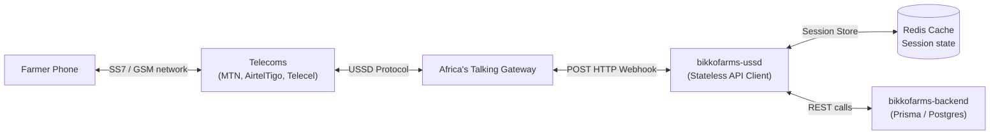
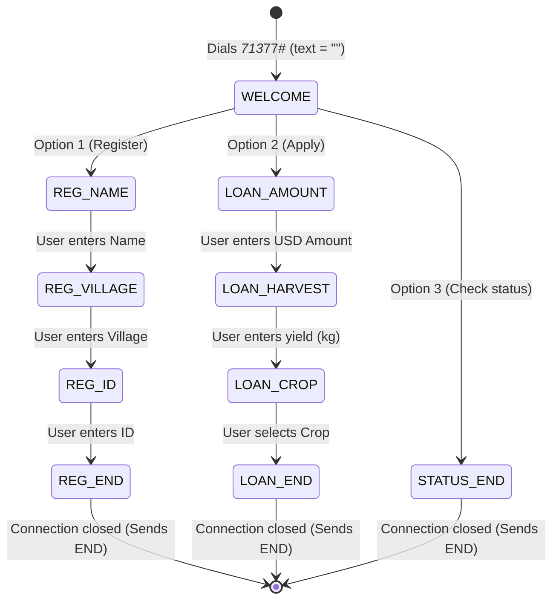
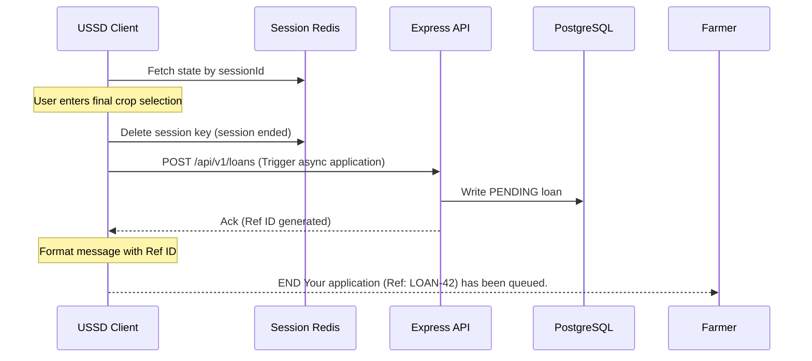

# BikkoChain USSD Client — Technical Architecture

This document details the software architecture, state machine logic, and integration protocols for the USSD (Unstructured Supplementary Service Data) farmer portal.

---

## 🔗 Architectural Relationships

- **Master System Architecture:** [`system_architecture.md`](../system_architecture.md)
- **Sibling WhatsApp Client:** [`bikkofarms-whatsappbot/ARCHITECTURE.md`](../bikkofarms-whatsappbot/ARCHITECTURE.md)
- **Contracts Escrow System:** [`bikkofarms-contracts/ARCHITECTURE.md`](../bikkofarms-contracts/ARCHITECTURE.md)

---

## 1. System Topology

The USSD service is designed as a stateless middleware gateway. It processes incoming url-encoded callbacks from the telecom aggregator (Africa's Talking) and uses Redis to reconstruct user sessions:



---

## 2. Dialogue State Machine

USSD sessions time out after **180 seconds** of inactivity due to telecom carrier limitations. To manage multi-step data entry (e.g. entering names, amounts, crops), dialogue state is cached in Redis using the Africa's Talking `sessionId` as the key.

### Session Payload Structure
Key: `ussd:session:{sessionId}`
TTL: `180 seconds`
```json
{
  "phoneNumber": "+233241112222",
  "currentState": "AWAITING_HARVEST",
  "data": {
    "farmerName": "Emmanuel Boateng",
    "village": "Tepa",
    "nationalId": "GHA-78912",
    "loanAmount": "120"
  }
}
```

### State Transitions



---

## 3. Communication Protocol

### 3.1 Gateway Payload Request
Sent by Africa's Talking on every user input:
- **`sessionId`:** Unique session identifier.
- **`phoneNumber`:** MSISDN format subscriber number (e.g. `+233241234567`).
- **`serviceCode`:** Dialed shortcode (e.g. `*713*77#`).
- **`text`:** Accumulated user inputs separated by asterisks (e.g. `""` for dial, `"1"` for Option 1, `"1*Emmanuel Boateng"`).

### 3.2 Gateway Response format
The server response must return HTTP `200 OK` and a `text/plain` body:
- **`CON ` prefix:** Tells the provider to wait for more input.
- **`END ` prefix:** Tells the provider to display the message and end the session.

#### Example USSD Application Handshake
```http
POST /webhook/ussd
Content-Type: application/x-www-form-urlencoded

sessionId=7e2d93e1a&phoneNumber=%2B233241234567&serviceCode=%2A713%2A77%23&text=2%2A150
```
*Application resolves session state, parses input `text.split('*')` (Option 2, Amount 150), and responds:*
```http
HTTP/1.1 200 OK
Content-Type: text/plain

CON Enter expected harvest yield in kg:
```

---

## 4. Integration with Core Backend

Because USSD sessions are sensitive to carrier timeouts, the USSD client must offload any long-running transactions to the Express backend.


