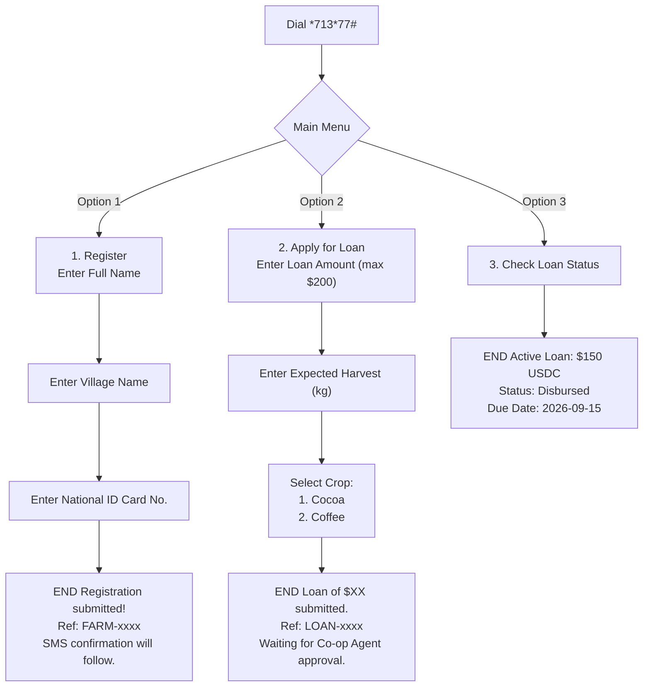
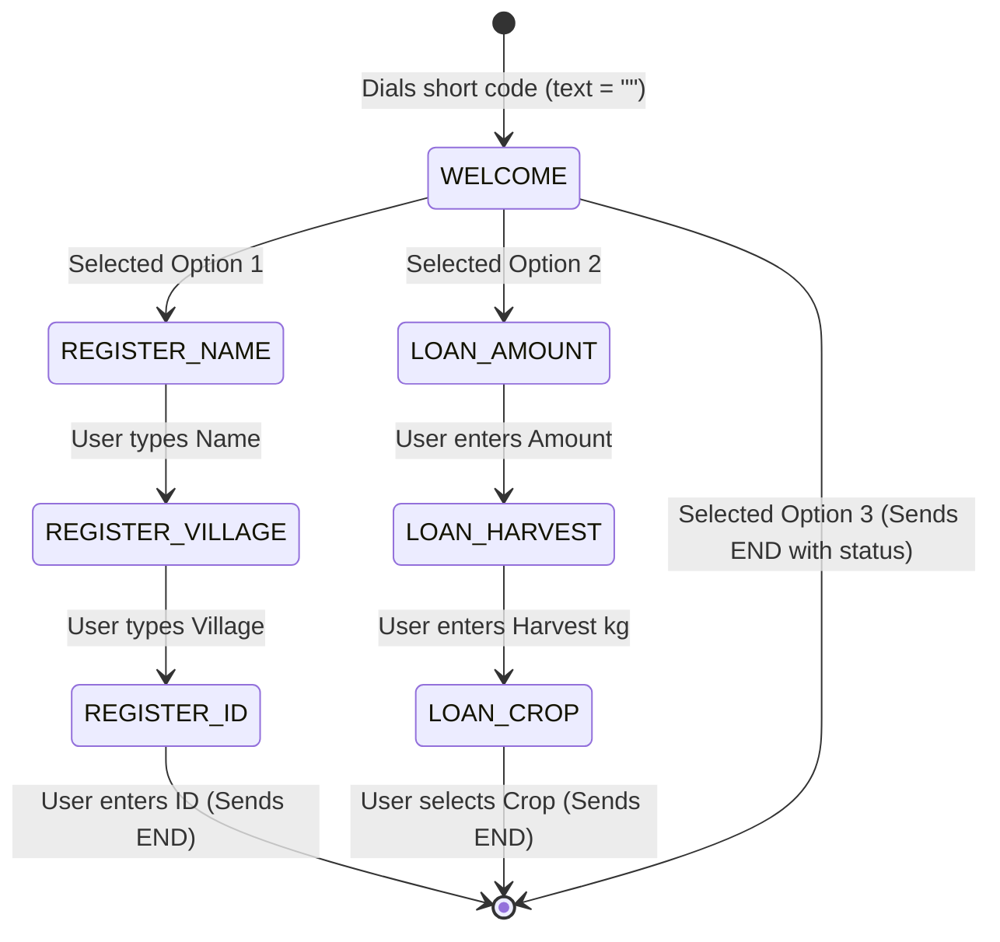

# bikkofarms-ussd

Stateless, event-driven USSD gateway handler for smallholder farmers using feature phones. Integrates with the **Africa's Talking USSD API** to provide instant access to registration, loan applications, and status updates.

---

## 🛠️ Stack & Concepts

| Technology | Purpose |
|---|---|
| Node.js 20 LTS | Runtime environment |
| TypeScript 5 | Safe compiler type checks |
| Express 4 | Stateless web handler for Africa's Talking POST callbacks |
| ioredis | Fast session caching & dialogue state management |
| Africa's Talking USSD | Network gateway handling telecom routing (MTN, AirtelTigo, Telecel) |

### ⚡ Key Architectural Concepts

- **Stateless Webhook Parsing:** The USSD gateway is completely stateless. Every keypress by a user triggers an HTTP POST request from Africa's Talking.
- **Asterisk Parsing:** The `text` field sent by the gateway accumulates user inputs separated by asterisks (e.g. `""` → `"2"` → `"2*100"` → `"2*100*400"`). We split this text to resolve the current active menu.
- **Short response constraints:** The server **must respond within 3 seconds** to prevent session drop-offs. No synchronous block or database transaction is run during web requests; heavy logic is enqueued to the backend queue.

---

## 📱 User-Side Menu Flow

Below is the user experience mapped step-by-step:



---

## ⚙️ Redis Session State Machine

To coordinate multi-page input, the USSD service uses Redis to cache session contexts. Sessions are keyed by Africa's Talking `sessionId` with a strict Time-To-Live (TTL) of **180 seconds** (matching telco session boundaries).

### State Transitions & Data Schema
Key: `ussd:session:{sessionId}`
```json
{
  "phoneNumber": "+233241234567",
  "currentState": "LOAN_AMOUNT",
  "data": {
    "loanAmount": "150"
  }
}
```



---

## 📡 Webhook Data Flow

Every menu action translates to a callback from Africa's Talking to our endpoint:

```
POST /webhook/ussd
Content-Type: application/x-www-form-urlencoded
```

### Callback Request Schema (from Africa's Talking)
- `sessionId`: Unique identifier of the USSD session (maps to Redis key).
- `phoneNumber`: The MSISDN of the mobile subscriber (e.g. `+233201112222`).
- `serviceCode`: The USSD code dialed (e.g. `*713*77#`).
- `text`: User inputs accumulated (`""`, `"1"`, `"1*John Okyere"`, etc.).

### Response Format
Your application must respond with raw text, prefixing the body to control the session:
- **`CON ` (Continue):** Tells the gateway to keep the session open and display a text field/prompt.
- **`END ` (End):** Tells the gateway to display the final message and tear down the connection.

*Example Response:*
```http
HTTP/1.1 200 OK
Content-Type: text/plain

CON Welcome to BikkoChain. Choose an option:
1. Register
2. Apply for Loan
3. Check Status
```

---

## 🚀 Setup & Local Development

### 1. Configure Sandbox Credentials
Ensure your environment variables are configured in `.env`:
```bash
AT_USERNAME=sandbox
AT_API_KEY=your_sandbox_api_key
REDIS_URL=redis://localhost:6379
BACKEND_API_URL=http://localhost:3000/api/v1
```

### 2. Start Services
Ensure Redis is running locally:
```bash
docker run --name ussd-redis -p 6379:6379 -d redis:7-alpine
```

Start the USSD application:
```bash
pnpm install
pnpm dev
```

### 3. Expose Callback Endpoint via ngrok
Africa's Talking needs a public URL. Expose your local port (e.g., `3001`):
```bash
ngrok http 3001
```
Copy the secure URL (e.g. `https://xxxx.ngrok-free.app`) and configure it as the **USSD Callback URL** inside the Africa's Talking developer console.

### 4. Test with USSD Simulator
1. Go to the Africa's Talking Sandbox Dashboard.
2. Launch the **USSD Simulator**.
3. Input your simulator phone number and dial `*713*77#` to test the full dialogue loop.
