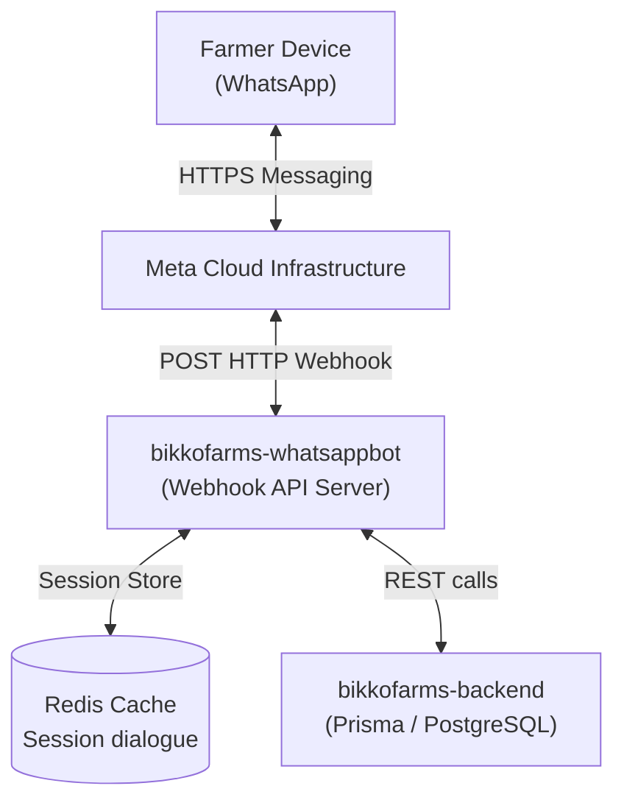
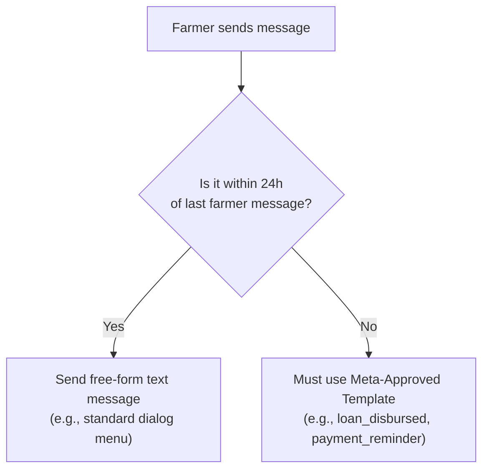

# BikkoChain WhatsApp Bot — Technical Architecture

This document outlines the software engineering principles, webhook verification, and session state architecture for the WhatsApp Bot portal.

---

## 🔗 Architectural Relationships

- **Master System Architecture:** [`system_architecture.md`](../system_architecture.md)
- **Sibling USSD Client:** [`bikkofarms-ussd/ARCHITECTURE.md`](../bikkofarms-ussd/ARCHITECTURE.md)
- **Contracts Escrow System:** [`bikkofarms-contracts/ARCHITECTURE.md`](../bikkofarms-contracts/ARCHITECTURE.md)

---

## 1. System Topology

The WhatsApp bot client connects farmers with the BikkoChain platform using Meta's Cloud API infrastructure.



---

## 2. Conversation Session Management

Unlike traditional chat clients, dialogue state is tracked statelessly on our server. Every message is matched against a Redis session keyed by the user's phone number.

- **Session Key:** `whatsapp:session:{phoneNumber}`
- **TTL (Time to Live):** **24 Hours** (refreshed on every user message).

### State Transitions

```mermaid
stateDiagram-v2
    [*] --> AWAITING_KEYWORD : User initiates chat
    AWAITING_KEYWORD --> AWAITING_AMOUNT : User types "APPLY"
    AWAITING_AMOUNT --> AWAITING_HARVEST : User enters amount (e.g. 150)
    AWAITING_HARVEST --> AWAITING_CONFIRMATION : User enters yield in kg (e.g. 500)
    AWAITING_CONFIRMATION --> LOAN_SUBMITTED : User types "CONFIRM"
    LOAN_SUBMITTED --> [*] : Dialog ends; Loan stored in DB
```



---

## 3. Webhook Authentication & Security

To prevent spoofing, the webhook utilizes signature checks at the API layer:

### 3.1 Handshake (GET Challenge Validation)
When registering the webhook, Meta sends a GET request to verify token alignment.
```typescript
// Express router validation example
app.get('/webhook/whatsapp', (req, res) => {
  if (req.query['hub.verify_token'] === process.env.WA_VERIFY_TOKEN) {
    return res.status(200).send(req.query['hub.challenge']);
  }
  res.sendStatus(403);
});
```

### 3.2 HMAC Payload Signature Check (POST)
Every incoming message request is signed by Meta using SHA-256. The signature is sent in the `X-Hub-Signature-256` header. We recalculate this signature against the request's raw body buffer using the `WA_APP_SECRET`.

```
Header: X-Hub-Signature-256 = sha256=abcdef123456...
Verification: Crypto.createHmac('sha256', APP_SECRET).update(rawBody).digest('hex')
```

---

## 4. Message Window & Template Policy

Meta enforces a strict **24-hour dialogue window**. Within this window, the bot can send free-form messages. If the window closes, the bot *cannot* initiate contact unless it uses a **Pre-Approved Message Template**.



### Template Example Payload
To notify a farmer of a successful disbursement after the agent's approval (which may happen hours or days later):

```json
{
  "messaging_product": "whatsapp",
  "to": "+233241234567",
  "type": "template",
  "template": {
    "name": "loan_disbursed",
    "language": { "code": "en_US" },
    "components": [
      {
        "type": "body",
        "parameters": [
          { "type": "text", "text": "2280" }, // GHS amount
          { "type": "text", "text": "2026-09-15" }, // Due date
          { "type": "text", "text": "LOAN-0042" } // Ref ID
        ]
      }
    ]
  }
}
```
This bypasses the 24-hour restriction, letting us alert the farmer directly on their phone.
