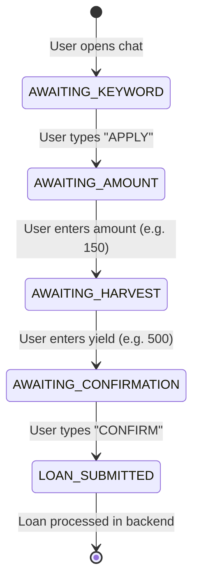

# bikkofarms-whatsappbot

Event-driven, conversational WhatsApp Bot client utilizing **Meta's official WhatsApp Cloud API**. Provides a secure, friendly chat-based portal for smallholder farmers to onboard, tokenize crop harvests, and submit micro-loan applications.

---

## 📐 Architecture

For full technical specifications, signature validations, and dialogue window guidelines, see the [**WhatsApp Bot Architecture**](./ARCHITECTURE.md) document.

---

## 🛠️ Stack & Concepts

| Technology | Purpose |
|---|---|
| Node.js 20 LTS | Execution runtime |
| TypeScript 5 | Structural compiler type checks |
| Express 4 | Webhook server mapping Meta events |
| ioredis | Dialog session state management |
| Meta Cloud API | Official API endpoint for sending/receiving WhatsApp Business messages |

### ⚡ Key Architectural Concepts

- **24-Hour Conversation Window:** Meta restricts messaging to a 24-hour window from the last user-initiated message. Messages within this window can be free-form. Messages sent *outside* this window must use pre-approved **Message Templates**.
- **HMAC Payload Verification:** To protect the endpoint from fake requests, every incoming POST request is signed by Meta. We verify the signature (`X-Hub-Signature-256`) against the `WA_APP_SECRET` using SHA-256.
- **Asynchronous Processing:** Long-running backend operations (such as token metadata pinning on IPFS or contract deployment checks) are enqueued. The bot acknowledges the message immediately to prevent Meta timeout retries.

---

## 💬 User-Side Conversation Flow

Below is an example dialogue tree representing the micro-loan application process:

```
Farmer                                                   WhatsApp Bot
  │                                                           │
  ├─────── "APPLY" (or "START") ─────────────────────────────>│
  │                                                           │
  │<────── "Welcome to BikkoChain! Let's get started. ────────┤
  │         Enter your requested loan amount in USDC          │
  │         (Limit: $200 USDC)"                               │
  │                                                           │
  ├─────── "150" ────────────────────────────────────────────>│
  │                                                           │
  │<────── "Loan Amount: $150. Now enter the expected ────────┤
  │         cocoa harvest batch size (in kg):"                │
  │                                                           │
  ├─────── "500" ────────────────────────────────────────────>│
  │                                                           │
  │<────── "Confirm details:                                 │
  │         - Amount: $150 USDC                               │
  │         - Collateral: 500kg Cocoa                         │
  │                                                           │
  │         Type 'CONFIRM' to submit your application." ──────┤
  │                                                           │
  ├─────── "CONFIRM" ────────────────────────────────────────>│
  │                                                           │
  │<────── "Application submitted! Ref: LOAN-0042. ───────────┤
  │         Co-op agent is reviewing. You will get            │
  │         notified here once disbursed."                    │
```

---

## ⚙️ Redis Conversation State Machine

Because chat platforms are asynchronous and multi-step, the bot stores conversation checkpoints in Redis.

- **Session Key:** `whatsapp:session:{phoneNumber}`
- **TTL (Time to Live):** **24 Hours** (refreshed on every user message).

### State Transition Diagram



---

## 📝 Pre-Approved Message Templates

When initiating contact or notifying farmers after the 24-hour conversation window has closed, the application sends **Meta Templates**.

### 1. `loan_approved`
- **Category:** Utility
- **Text:** *"Hi {{1}}, your BikkoChain micro-loan application {{2}} of {{3}} USDC has been approved! We are now initiating the payment to your MTN MoMo wallet. Please stand by."*

### 2. `loan_disbursed`
- **Category:** Utility
- **Text:** *"Success! {{1}} GHS has been sent to your mobile wallet. Your repayment due date is {{2}}. Ref ID: {{3}}."*

### 3. `repayment_reminder`
- **Category:** Utility
- **Text:** *"Friendly reminder from BikkoChain: Your loan {{1}} of {{2}} USDC is due on {{3}}. Please ensure your mobile wallet contains sufficient GHS to complete the repayment."*

---

## 🔏 Webhook Verification & Security

### 1. Webhook Challenge (GET)
When configuring the webhook in the Meta App Developer Portal, Meta sends a `GET` request to verify the server's validity:

```typescript
app.get('/webhook/whatsapp', (req, res) => {
  const mode = req.query['hub.mode'];
  const token = req.query['hub.verify_token'];
  const challenge = req.query['hub.challenge'];

  if (mode === 'subscribe' && token === process.env.WA_VERIFY_TOKEN) {
    return res.status(200).send(challenge);
  }
  return res.sendStatus(403);
});
```

### 2. Signature Validation (POST)
To protect endpoints, verify signatures:

```typescript
import crypto from 'crypto';

function verifySignature(req, res, next) {
  const signature = req.headers['x-hub-signature-256'] as string;
  if (!signature) return res.sendStatus(401);

  const elements = signature.split('=');
  const signatureHash = elements[1];
  const expectedHash = crypto
    .createHmac('sha256', process.env.WA_APP_SECRET!)
    .update(req.rawBody)
    .digest('hex');

  if (signatureHash !== expectedHash) {
    return res.sendStatus(403);
  }
  next();
}
```

---

## 🚀 Setup & Local Development

### 1. Set Up Meta Developer App
1. Register as a developer on [developers.facebook.com](https://developers.facebook.com).
2. Create a "Business" type app and select **WhatsApp**.
3. Under WhatsApp Settings, configure a temporary test phone number and retrieve your `PHONE_NUMBER_ID` and `CLOUD_API_ACCESS_TOKEN`.

### 2. Configure Local Environment Variables
Create a `.env` file in `bikkofarms-whatsappbot/`:
```bash
WA_PHONE_NUMBER_ID=your_phone_number_id
WA_BUSINESS_ACCOUNT_ID=your_business_id
CLOUD_API_ACCESS_TOKEN=your_meta_access_token
CLOUD_API_VERSION=v20.0
WA_VERIFY_TOKEN=any_secure_verify_token_configured_in_meta
WA_APP_SECRET=your_meta_app_secret
REDIS_URL=redis://localhost:6379
BACKEND_API_URL=http://localhost:3000/api/v1
```

### 3. Expose Webhook via ngrok
WhatsApp API requires a secure, public HTTPS endpoint:
```bash
ngrok http 3002
```
Configure your Meta App webhook callback URL to `https://<ngrok_id>.ngrok-free.app/webhook/whatsapp`.

### 4. Run the Client
```bash
pnpm install
pnpm dev
```
Use your WhatsApp mobile client to send the keyword `APPLY` to your configured Meta test number to verify the conversational sequence.
