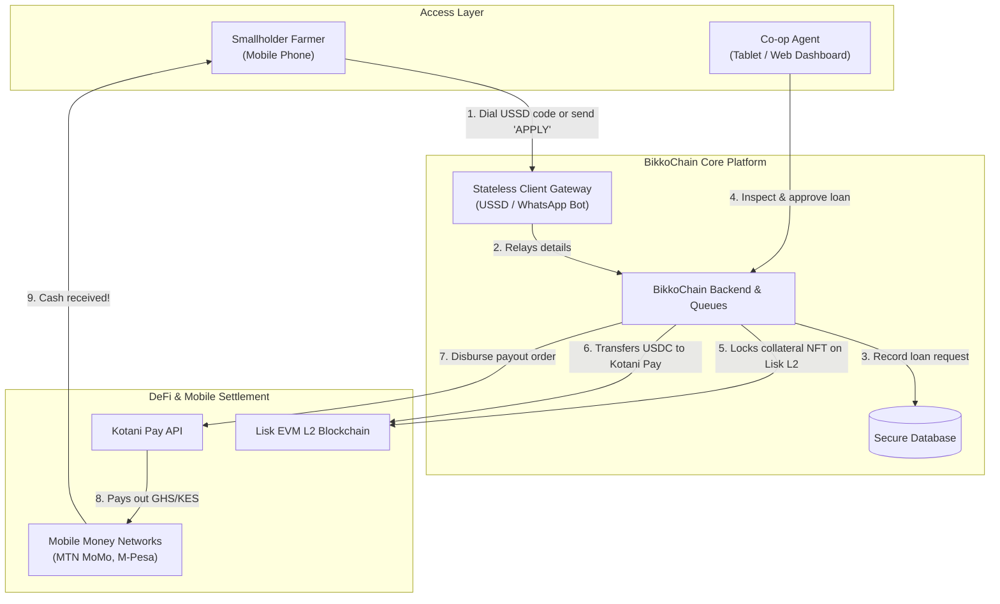
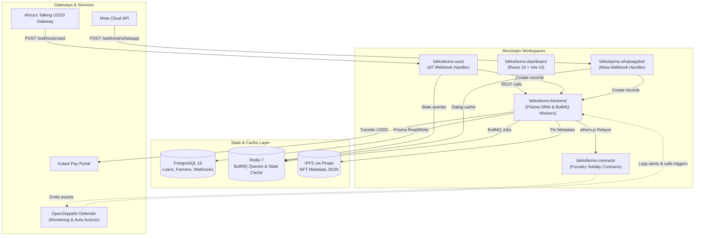
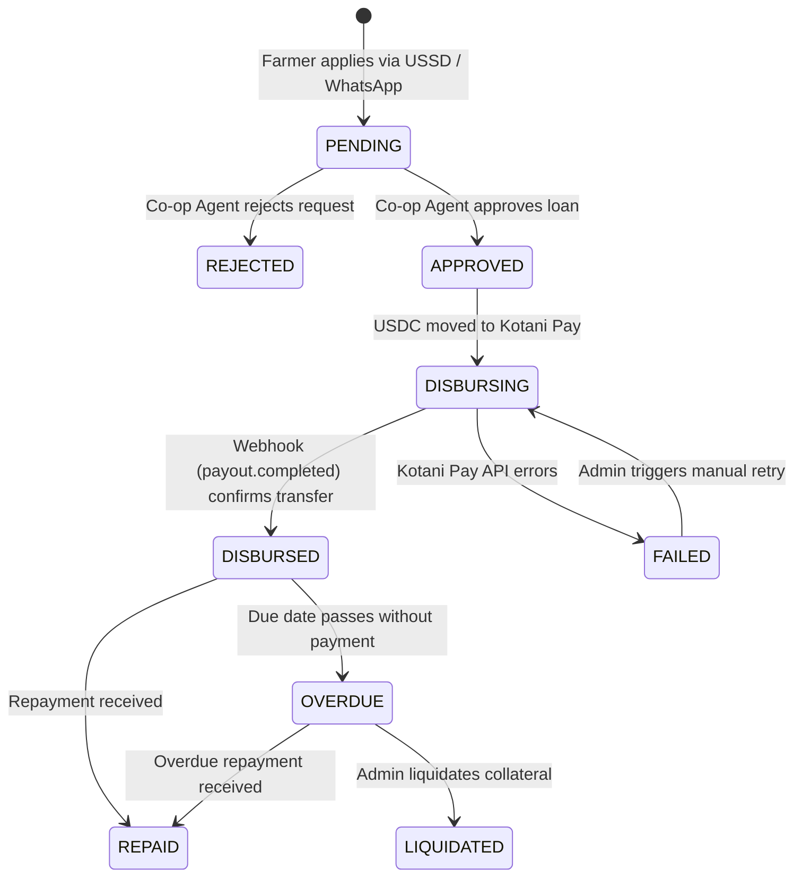
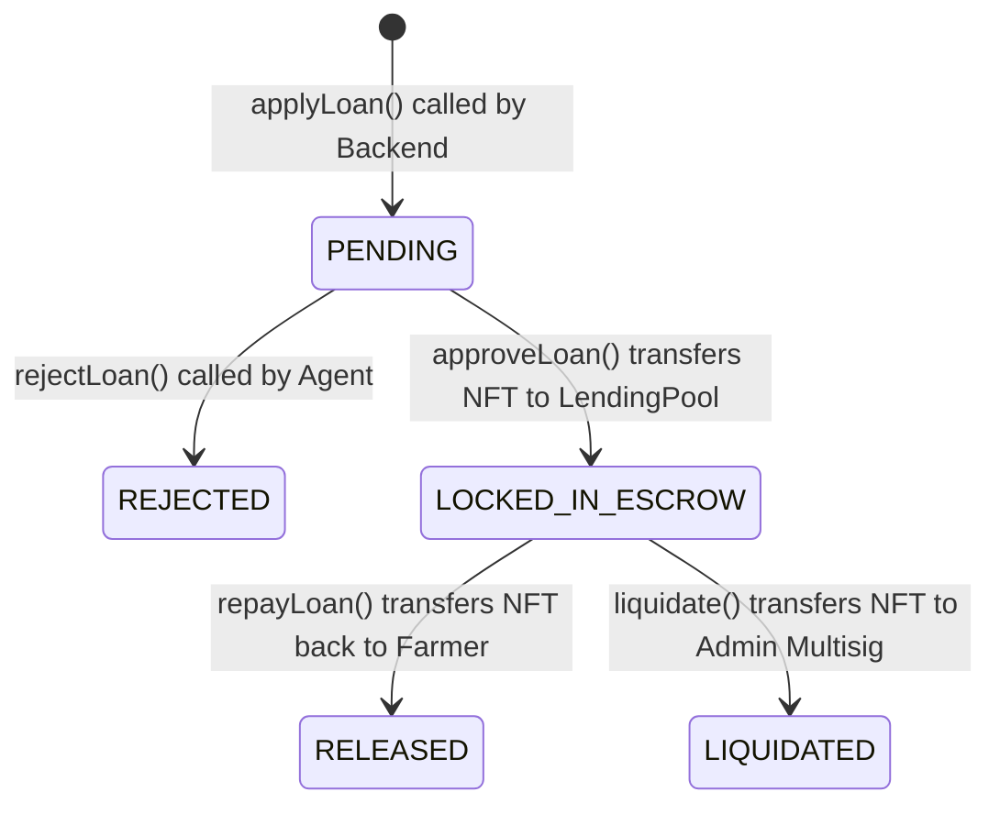
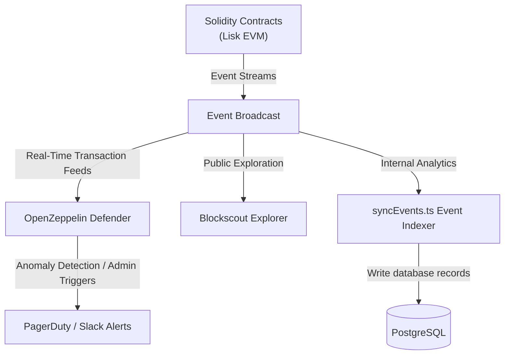
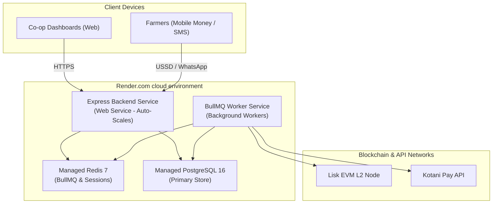

# BikkoChain — Master System Architecture & Engineering Brief (A–Z)

**Prepared for:** Technical Partners, Engineers, and Stakeholders  
**Date:** June 2026  
**Version:** 1.1 (Foundry & Multi-Client Edition)

---

## 1. Executive Summary

BikkoChain is a blockchain-powered agricultural micro-lending platform. It bridges the gap between decentralized finance (DeFi) and smallholder farmers in sub-Saharan Africa. Using a feature phone (via USSD) or a smartphone (via WhatsApp), a farmer tokenizes their future harvest crop (cocoa/coffee) as collateral, applies for a micro-loan, receives instant co-op agent approval, and has stablecoins (USDC) automatically swapped and disbursed as fiat (GHS/KES) directly to their mobile money account.

---

## 2. High-Level Stakeholder & User Flow (Non-Technical)

This diagram describes how value, assets, and requests move between different users and entities:



### 👤 The Farmer's Experience
1. **Onboarding:** The farmer registers once by entering their Name, Village, and National ID number using a USSD menu (`*713*77#`) or WhatsApp.
2. **Tokenization:** On-chain, a **Harvest Token NFT** is minted to represent their crop yield.
3. **Borrowing:** The farmer applies for a loan (e.g. $150 USDC).
4. **Cash Payout:** Once approved, the cash is deposited into their mobile money wallet in under 2 minutes. No crypto knowledge is required.

### 💼 The Stakeholder & Liquidity Provider Experience
- **Cooperative Agents:** Review physical farm details and approve loans via a secure React Web Dashboard.
- **Liquidity Providers:** Yield-seeking capital is deposited into the `BikkoLendingPool` contract on Lisk L2 as USDC. When farmers repay, principal plus interest flows back to these pools.
- **Auditors & Regulators:** Can verify crop locations (GPS data), harvest sizes, and deforestation-free compliance (EUDR) directly via metadata pinned on IPFS.

---

## 3. Engineering Specification & Technical Architecture

The architecture below maps every package, database, queue, and smart contract:



### 3.1 Monorepo Package Breakdown
1. **`bikkofarms-ussd`:** Lightweight client managing stateless Africa's Talking session redirects and dialogue navigation. For implementation details, see [**USSD Client Architecture**](./bikkofarms-ussd/ARCHITECTURE.md).
2. **`bikkofarms-whatsappbot`:** Client processing WhatsApp message templates, HMAC signature verification, and Meta Cloud API messages. For implementation details, see [**WhatsApp Bot Architecture**](./bikkofarms-whatsappbot/ARCHITECTURE.md).
3. **`bikkofarms-backend`:** Central API engine. Houses database routers, background BullMQ workers, and the blockchain service.
4. **`bikkofarms-dashboard`:** UI client for cooperative managers to inspect credit applications, track repayments, and monitor default rates.
5. **`bikkofarms-contracts`:** Foundry-compiled smart contracts executing secure lending, collateral locking, and price feed updates. For security hierarchy and access maps, see [**Smart Contract Architecture**](./bikkofarms-contracts/ARCHITECTURE.md).

---

## 4. End-to-End Loan Transaction Sequence (A–Z)

Below is the chronological sequence of events, from first onboarding to repayment:

```mermaid
sequenceDiagram
    autonumber
    actor Farmer as Farmer (USSD / Bot)
    participant Client as Client Gateway (Bot/USSD)
    participant Backend as Express Backend
    participant Redis as Redis Cache
    participant DB as PostgreSQL DB
    participant Chain as Lisk EVM L2
    actor Agent as Co-op Agent (Dashboard)
    participant Kotani as Kotani Pay API

    Note over Farmer, Chain: Phase A: Onboarding & Tokenization
    Farmer->>Client: Register name, GPS, national ID
    Client->>Backend: POST /api/v1/farmers
    Backend->>DB: Encrypt name & ID; insert record
    Backend->>Chain: Mint HarvestToken (ERC-1155 NFT) to farmer wallet
    Chain-->>Backend: Return NFT tokenId
    Backend->>DB: Link tokenId to Farmer record
    Backend->>Client: Send registration confirmation SMS/WhatsApp
    Client->>Farmer: "Onboarded. ID: FARM-102"

    Note over Farmer, Kotani: Phase B: Loan Application & Collateral Lock
    Farmer->>Client: Apply for $150 USDC loan
    Client->>Redis: Check current dialogue tree status
    Client->>Backend: POST /api/v1/loans {amount: 15000, harvestKg: 500}
    Backend->>Chain: Check BikkoOracle price (e.g. Cocoa = $3.20/kg)
    Note over Backend: LTV Limit Check: 500kg * $3.20 * 70% LTV = $1120 Max. $150 is Safe.
    Backend->>DB: Create Loan in PENDING status
    Agent->>Backend: PUT /api/v1/loans/:id/approve (JWT Auth)
    Backend->>Chain: BikkoLendingPool.approveLoan(loanId)
    Note over Chain: Contract safeTransferFrom (Locks NFT Collateral in LendingPool)
    Chain-->>Backend: Emit LoanApproved event
    Backend->>DB: Update status to APPROVED

    Note over Backend, Kotani: Phase C: USDC Exchange & Mobile Disbursement
    Backend->>Chain: Transfer 150 USDC to Kotani Pay deposit address
    Backend->>Kotani: POST /v1/payouts {recipient mobile phone, amount GHS}
    Backend->>DB: Update status to DISBURSING
    Kotani->>Farmer: Disburse GHS to Mobile Money wallet
    Kotani->>Backend: Webhook callback (payout.completed)
    Backend->>DB: Update status to DISBURSED
    Backend->>Farmer: Send payout receipt notification

    Note over Farmer, Chain: Phase D: Repayment & Collateral Release
    Farmer->>Kotani: Send GHS/KES mobile money repayment
    Kotani->>Chain: Swap fiat → USDC; transfer USDC to LendingPool
    Backend->>Chain: BikkoLendingPool.repayLoan(loanId)
    Note over Chain: Release HarvestToken NFT back to farmer wallet
    Chain-->>Backend: Emit LoanRepaid event
    Backend->>DB: Update status to REPAID
    Backend->>Farmer: Send "Collateral Released" confirmation message
```

---

## 5. State Machine Diagrams

### 5.1 Off-Chain Loan Status (PostgreSQL)
Tracks database loan records manipulated by webhooks, queues, and agent actions:



### 5.2 On-Chain Escrow State (BikkoLendingPool.sol)
Tracks Solidity contract variables and escrow asset lockups:



---

## 6. Smart Contract Security, Governance, and Monitoring

Security is enforced at the protocol layer to eliminate single points of failure:

### 6.1 Access Control & Wallet Roles
Access is partitioned using OpenZeppelin `AccessControl`.

| Role Name | EOA/Multisig Holder | Permissions | Security Boundary |
|---|---|---|---|
| `DEFAULT_ADMIN_ROLE` | Gnosis Safe 2-of-3 Multisig | Pause/unpause contracts, change LTV, execute liquidations, trigger emergency returns | Cannot perform instant upgrades (timelocked) |
| `GUARDIAN_ROLE` | On-Call Engineer Wallet | Can call `pause()` immediately | Cannot unpause, cannot move funds, cannot upgrade |
| `AGENT_ROLE` | Backend Relayer Wallet | Approve loans, reject loans, verify repayment status | Cannot mint NFTs, cannot change prices |
| `MINTER_ROLE` | Backend Bot Wallet | Mint HarvestToken NFTs | Cannot approve loans, cannot withdraw assets |
| `ORACLE_UPDATER_ROLE` | Backend Cron Wallet | Update cocoa/coffee prices | Cannot transfer tokens, capped at 50% max price deviation check |
| `UPGRADER_ROLE` | TimelockController | Authorize implementation proxy upgrades | Only executable after 7-day queue delay |

### 6.2 Selective Upgradeability
- **Immutable Contracts (`HarvestToken.sol`, `BikkoOracle.sol`):** Keeping these immutable prevents an admin key compromise from modifying NFT logic or oracle price caps.
- **Upgradeable Proxy (`BikkoLendingPool.sol`):** Wrapped in a `TransparentUpgradeableProxy` so lending logic and fee formulas can evolve. Any upgrade proposal requires a **7-day timelock**, allowing users to exit the platform if they disagree.

### 6.3 Emergency Procedures
- **`pause()`:** If anomalous lending patterns are detected, the Guardian wallet can pause lending pools to freeze operations.
- **`emergencyReturn()`:** If Kotani Pay fails permanently or a farmer experiences systemic crop failure, the Gnosis Safe Admin can return the collateral NFT directly to the farmer without requiring repayment.

### 6.4 Monitoring Stack
We use a three-pronged monitoring approach to verify contract integrity:



1. **OpenZeppelin Defender:**
   - **Sentinel Monitoring:** Tracks transaction events in real-time. Alerts on role changes, oracle updates exceeding standard bounds, and transactions triggered by non-relayer addresses.
   - **Relay Gas Tracking:** Tracks relayer wallet balances and triggers warning webhooks when gas levels fall below limits.
   - **Autotasks:** Triggers automated pausing if transaction volume anomalies are observed.
2. **Blockscout Explorer:**
   - Provides public verification and contract source code interactions. Users, stakeholders, and developers can view addresses and contract states.
3. **Backend Event Indexer (`syncEvents.ts`):**
   - Polls Lisk Sepolia nodes for `LoanApproved`, `LoanRepaid`, and `CollateralLiquidated` logs, updating the local database inside the transaction window.

---

## 7. Foundry-Specific Technical Specifications

The smart contract suite uses Foundry. All compilation and tests are written in Solidity.

### 7.1 Monorepo Folder Structure (`bikkofarms-contracts/`)
```
bikkofarms-contracts/
├── lib/                     # OpenZeppelin and Solmate submodules
├── src/                     # Core Solidity contracts
│   ├── HarvestToken.sol
│   ├── BikkoLendingPool.sol
│   └── BikkoOracle.sol
├── test/                    # Solidity tests
│   ├── HarvestToken.t.sol
│   ├── BikkoLendingPool.t.sol
│   └── BikkoOracle.t.sol
├── script/                  # Solidity deployment scripts
│   └── Deploy.s.sol
└── foundry.toml             # Forge configurations
```

### 7.2 Configuration (`foundry.toml`)
```toml
[profile.default]
src = "src"
out = "out"
libs = ["lib"]
solc = "0.8.20"
optimizer = true
optimizer_runs = 200

[rpc_endpoints]
liskSepolia = "https://rpc.sepolia-api.lisk.com"
liskMainnet = "https://rpc.api.lisk.com"
```

---

## 8. Deployment Architecture (Render Cloud Hosting)

For MVP and rapid iteration, the infrastructure is hosted on **Render.com** (backed by AWS under the hood) for clean cost division and environment groups:



### 8.1 Render Hosting Setup
- **Express Backend Service:** Main endpoint exposing webhooks and dashboard APIs. Automatically pulls updates from the `main` branch.
- **BullMQ Worker Service:** A background Render service running `node dist/jobs/worker.js`. Scaled separately to handle payment retries and event indexing.
- **Render PostgreSQL:** Primary SQL store, configured inside a private virtual network. Not accessible from the public internet.
- **Render Redis:** Key-value store hosting USSD session steps and BullMQ queue message brokers.
