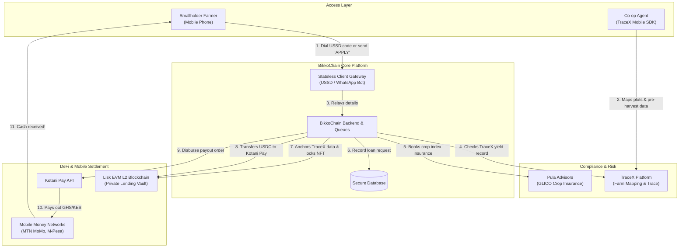
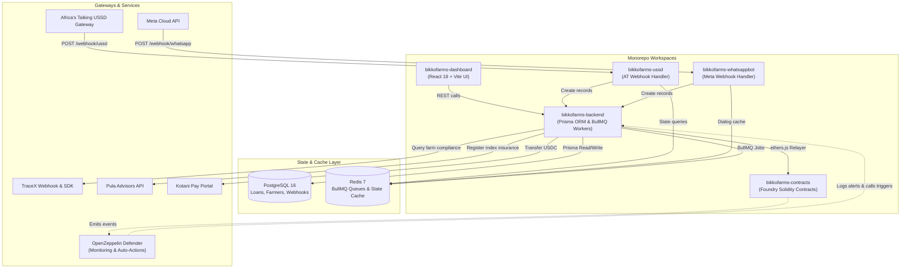
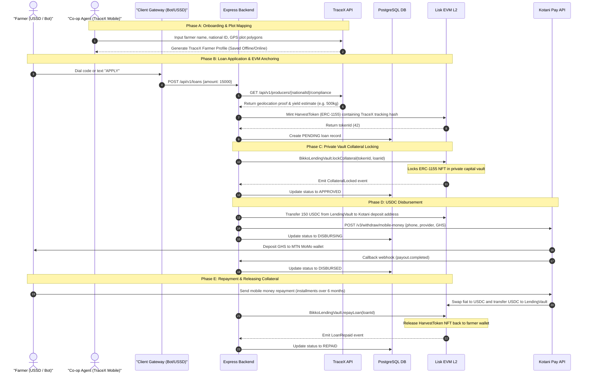
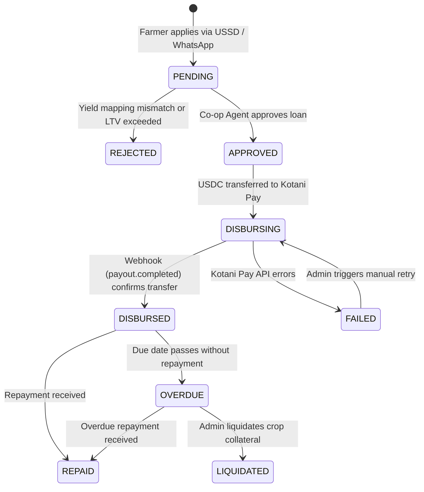
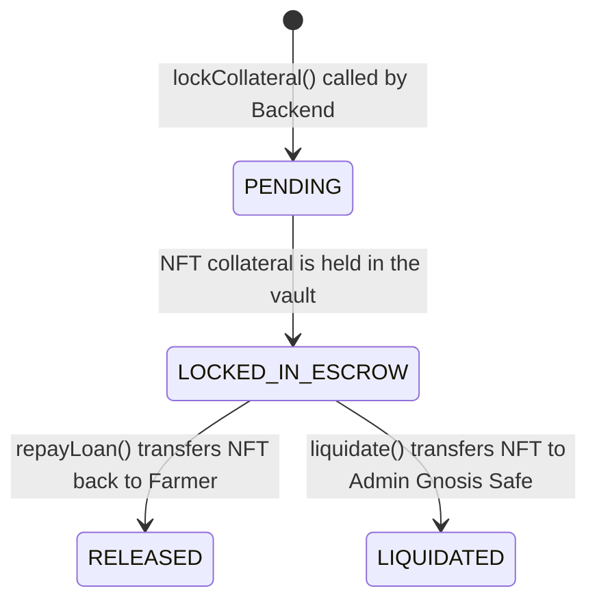
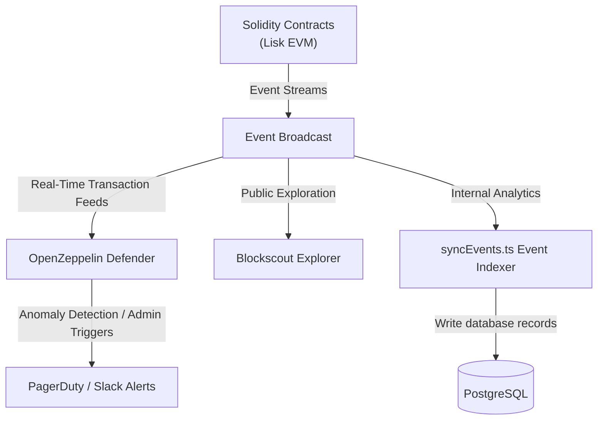
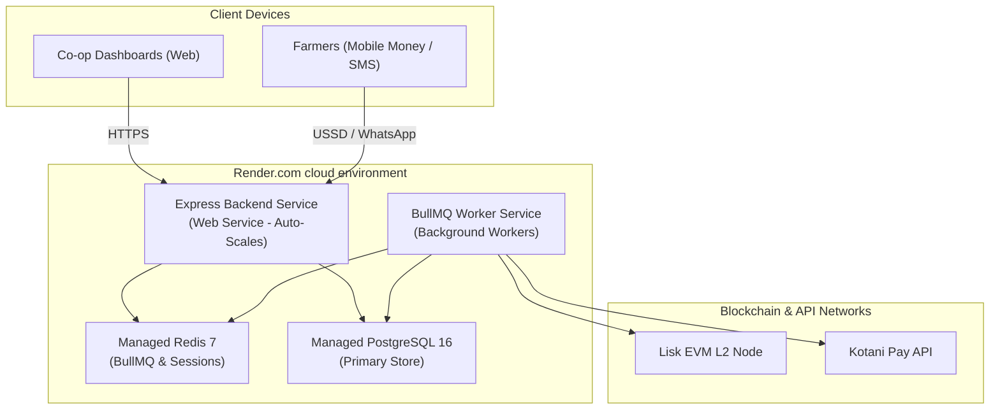

# BikkoChain — Master System Architecture & Engineering Brief (A–Z)

**Prepared for:** Technical Partners, Engineers, and Stakeholders  
**Date:** July 2026  
**Version:** 1.2 (TraceX & Private Vault Edition)

---

## 1. Executive Summary

BikkoChain is a blockchain-powered agricultural micro-lending platform. It bridges the gap between decentralized finance (DeFi) and smallholder farmers in sub-Saharan Africa. Shifting to a cooperative-led trust model, the platform leverages established agricultural cooperatives to onboard farmers, map crop plots, and verify yield records. 

Using simple feature phones (via USSD) or smartphones (via WhatsApp), farmers register and apply for micro-loans. BikkoChain tokenizes cocoa harvests using **TraceX** tracking frameworks, anchors compliance events on **Lisk L2** (satisfying EUDR requirements), and automatically disburses cash directly to farmers' MTN MoMo wallets via the **Kotani Pay v3 API**. Loans are guaranteed under a co-op group-liability model, and derisked using **Pula Advisors Area Yield Index Insurance (AYII)**.

---

## 2. High-Level Stakeholder & User Flow (Non-Technical)

This diagram describes how value, assets, and requests move between different users, systems, and entities:



### 👤 The Farmer's Experience
1. **Onboarding:** The cooperative maps the farmer's plot boundaries and records yield forecasts using the **TraceX Mobile SDK** offline in the field.
2. **Borrowing:** The farmer dials `*713*77#` (USSD) or messages the WhatsApp bot to request a loan.
3. **Cash Payout:** Once approved, GHS is disbursed directly to their mobile money wallet in under 2 minutes. No blockchain knowledge is required.

### 💼 The Stakeholder & Liquidity Provider Experience
- **Cooperatives:** Act as the trust nodes, guaranteeing loans under a group-liability model. Co-ops receive a 2% performance buffer if their farmers repay on time.
- **Lenders (BikkoChain Vault):** In Phase 1, capital is supplied to a private lending vault (`BikkoLendingVault.sol`) funded directly by our founders and partners. In Phase 2, this is upgraded to a permissionless **Morpho Blue** pool.
- **Insurers (Pula / GLICO):** Area Yield Index Insurance pays out directly to the platform if regional weather anomalies drop the average harvest yield below a set threshold.

---

## 3. Engineering Specification & Technical Architecture

The architecture below maps every monorepo package, database, queue, and integration endpoint:



### 3.1 Monorepo Package Breakdown
1. **`bikkofarms-ussd`:** Stateless microservice managing USSD menu rendering and session context routing. For implementation details, see [**USSD Client Architecture**](./bikkofarms-ussd/ARCHITECTURE.md).
2. **`bikkofarms-whatsappbot`:** Webhook client processing Meta Cloud API conversational sessions, HMAC signature checks, and dialog trees. For implementation details, see [**WhatsApp Bot Architecture**](./bikkofarms-whatsappbot/ARCHITECTURE.md).
3. **`bikkofarms-backend`:** Main API gateway containing database models, BullMQ task workers, event indexers, and blockchain connectors.
4. **`bikkofarms-dashboard`:** Web interface for cooperative managers to inspect loan applications, track repayments, and manage farmer databases.
5. **`bikkofarms-contracts`:** Foundry-based smart contracts mapping harvest tokenization and private vault lending. For security mapping, see [**Smart Contract Architecture**](./bikkofarms-contracts/ARCHITECTURE.md).

---

## 4. End-to-End Loan Transaction Sequence (A–Z)

This sequence diagram tracks onboarding, tracing, lending, and repayment:



---

## 5. State Machine Diagrams

### 5.1 Off-Chain Loan Status (PostgreSQL)
Tracks database loan records updated by dashboard triggers and external callbacks:



### 5.2 On-Chain Escrow State (BikkoLendingVault.sol)
Tracks Solidity smart contract states and asset lockups:



---

## 6. Smart Contract Security, Governance, and Monitoring

Security is enforced at the protocol layer to protect the private capital pool:

### 6.1 Access Control & Wallet Roles
Access is partitioned using OpenZeppelin `AccessControl`.

| Role Name | EOA/Multisig Holder | Permissions | Security Boundary |
|---|---|---|---|
| `DEFAULT_ADMIN_ROLE` | Gnosis Safe 2-of-3 Multisig | Pause/unpause contracts, modify LTV, execute liquidations, trigger emergency returns | Cannot perform instant upgrades (timelocked) |
| `GUARDIAN_ROLE` | On-Call Engineer Wallet | Can call `pause()` immediately | Cannot unpause, cannot move funds, cannot upgrade |
| `AGENT_ROLE` | Backend Relayer Wallet | Approve loans, verify repayment status | Cannot mint NFTs, cannot change prices |
| `MINTER_ROLE` | Backend Bot Wallet | Mint HarvestToken NFTs (containing TraceX hashes) | Cannot approve loans, cannot withdraw assets |
| `ORACLE_UPDATER_ROLE` | Backend Cron Wallet | Update cocoa/coffee prices | Cannot transfer tokens, capped at 50% max price deviation check |
| `UPGRADER_ROLE` | TimelockController | Authorize implementation proxy upgrades | Only executable after 7-day queue delay |

### 6.2 Selective Upgradeability
- **Immutable Contracts (`HarvestToken.sol`, `BikkoOracle.sol`):** Keeping these immutable prevents an admin key compromise from modifying NFT logic or oracle price caps.
- **Upgradeable Proxy (`BikkoLendingVault.sol`):** Wrapped in a `TransparentUpgradeableProxy` so lending parameters can evolve. Any upgrade proposal requires a **7-day timelock**, allowing users to exit the platform if they disagree.

### 6.3 Transition Path to Morpho Blue (Phase 2)
In Phase 2, we will migrate from the private `BikkoLendingVault.sol` to a public decentralized model using **Morpho Blue**:
* **Morpho Blue Market Deployment:** We will deploy a permissionless market on Morpho Blue with `HarvestToken` (ERC-1155 wrapper) as collateral and `USDC` as the borrowable asset.
* **Adapter Integration:** We will deploy `BikkoMorphoAdapter.sol` to interface between the backend and Morpho, allowing automated borrowing/supplying on behalf of co-ops using the crop NFTs as collateral.

### 6.4 Monitoring Stack
We use a three-pronged monitoring approach to verify contract integrity:



1. **OpenZeppelin Defender:**
   - **Sentinel Monitoring:** Tracks transaction events in real-time. Alerts on role changes, oracle updates exceeding standard bounds, and transactions triggered by non-relayer addresses.
   - **Relay Gas Tracking:** Tracks relayer wallet balances and triggers warning webhooks when gas levels fall below limits.
   - **Autotasks:** Triggers automated pausing if transaction volume anomalies are observed.
2. **Blockscout Explorer:**
   - Provides public verification and contract source code interactions. Users, stakeholders, and developers can view addresses and contract states.
3. **Backend Event Indexer (`syncEvents.ts`):**
   - Polls Lisk Sepolia nodes for `LoanApproved`, `LoanRepaid`, and `CollateralLiquidated` logs, updating the local database inside the transaction window.

---

## 7. Foundry-Specific Technical Specifications

The smart contract suite uses Foundry. All compilation and tests are written in Solidity.

### 7.1 Monorepo Folder Structure (`bikkofarms-contracts/`)
```
bikkofarms-contracts/
├── lib/                     # OpenZeppelin and Solmate submodules
├── src/                     # Core Solidity contracts
│   ├── HarvestToken.sol
│   ├── BikkoLendingVault.sol
│   └── BikkoOracle.sol
├── test/                    # Solidity tests
│   ├── HarvestToken.t.sol
│   ├── BikkoLendingVault.t.sol
│   └── BikkoOracle.t.sol
├── script/                  # Solidity deployment scripts
│   └── Deploy.s.sol
└── foundry.toml             # Forge configurations
```

### 7.2 Configuration (`foundry.toml`)
```toml
[profile.default]
src = "src"
out = "out"
libs = ["lib"]
solc = "0.8.20"
optimizer = true
optimizer_runs = 200

[rpc_endpoints]
liskSepolia = "https://rpc.sepolia-api.lisk.com"
liskMainnet = "https://rpc.api.lisk.com"
```

---

## 8. Deployment Architecture (Render Cloud Hosting)

For MVP and rapid iteration, the infrastructure is hosted on **Render.com** (backed by AWS under the hood) for clean cost division and environment groups:



### 8.1 Render Hosting Setup
- **Express Backend Service:** Main endpoint exposing webhooks and dashboard APIs. Automatically pulls updates from the `main` branch.
- **BullMQ Worker Service:** A background Render service running `node dist/jobs/worker.js`. Scaled separately to handle payment retries and event indexing.
- **Render PostgreSQL:** Primary SQL store, configured inside a private virtual network. Not accessible from the public internet.
- **Render Redis:** Key-value store hosting USSD session steps and BullMQ queue message brokers.
